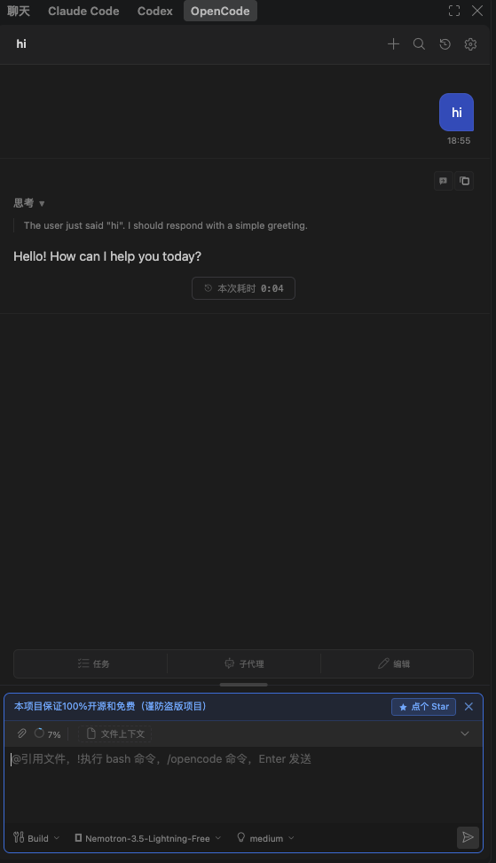
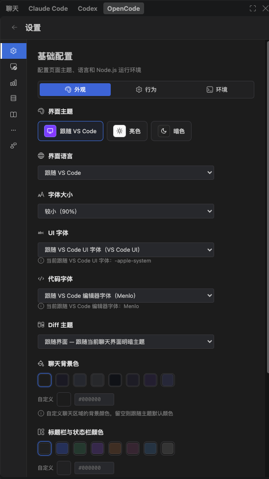

# OpenCode Buddy

一个将 **opencode** agent 带入完整聊天 GUI 的 VS Code 扩展。开发初衷是已有vs code opencode插件太难用了。在github上搜索到cc-gui开源项目。这是 IntelliJ 插件 [`jetbrains-cc-gui`](https://github.com/zhukunpenglinyutong/jetbrains-cc-gui) 的全新移植版本：React webview 原样保留，Java 后端用 TypeScript 重写，仅保留 **opencode** provider（已移除 Claude / Codex / Grok / Kimi / PI 分支）。

与原插件为每条消息都生成新的 `opencode run` 进程不同，本扩展维护一个**持久化的 `opencode serve` 守护进程**（通过 `@opencode-ai/sdk`），跨所有标签页和对话复用，由守护进程桥接管理，支持预热、心跳、崩溃重启和会话复用。

## 项目理念

[`jetbrains-cc-gui`](https://github.com/zhukunpenglinyutong/jetbrains-cc-gui) 的开发方向是兼容各个 AI 的差异，在插件中提供统一的体验。这与本项目的思路不同——本项目旨在**复用 opencode 的能力，不做二次开发**，专注于为 opencode 提供原生的 GUI 体验。

## 开发工具

本项目主要使用 AI 辅助开发：

- **AI 工具**：OpenCode（主要）、Claude Code、WorkBuddy
- **AI 模型**：Deepseek-v4-flash（主要）、Deepseek-v4-pro、MiMo V2.5、Ox Alpha、hy4、hy3

大部分开发使用免费额度，Deepseek 成本 65.34 元人民币。

## 功能特性

- **持久化 opencode 守护进程** — 无需为每条消息生成进程。`opencode serve` 在激活时预热，跨请求复用，崩溃时自动重启（≤3 次）。
- **双聊天界面** — 活动栏面板（左侧）和辅助侧边栏面板（右侧），加上**多标签页**编辑器会话（每个标签页是独立的 `createWebviewPanel`，拥有自己的对话）。
- **完整 cc-gui UI** — 流式文本/思考/工具调用及差异显示、模型/模式/斜杠命令选择器、token 使用量环形图、附件和文件上下文、对话历史、MCP 服务器、agent/skill/prompt 管理、权限/问题/计划审批对话框，以及设置面板。
- **仅支持 opencode** — webview、宿主处理器和 CLI 工具已精简为仅支持 opencode。

## 使用教程

### 1. 打开聊天面板

安装插件后，点击 VS Code 侧栏的 OpenCode 图标即可打开聊天界面。或者通过命令面板执行 `OpenCode: 在编辑器分栏打开 OpenCode`，在编辑器分栏中打开一个独立的标签页（每个标签页都是一个独立的会话）。



界面区域一览：

- **顶部 tab**：`聊天 / Claude Code / Codex / OpenCode` —— 快速切换不同会话。
- **右上角**：新建会话 / 搜索 / 历史 / 设置。
- **底部三栏**：
  - `任务 / 子代理 / 编辑` —— 切换输入模式。
  - `Build` —— 选择工作模式（Build / Plan 等）。
  - **模型选择** —— 切换当前模型（例如 `Nemotron-3.5-Lightning-Free`）。
  - **推理深度** —— 例如 `medium`，控制模型思考深度。
- **输入框**：支持 `@文件名` 引用文件、`/bash 命令`、`/opencode 命令`，回车发送。

### 2. 个性化设置

点击聊天界面右上角的齿轮图标打开设置面板：



**基础配置 → 外观** 主要选项：

| 项 | 说明 |
|---|---|
| 界面主题 | 跟随 VS Code / 亮色 / 暗色 |
| 界面语言 | 跟随 VS Code |
| 字体大小 / UI 字体 / 代码字体 | 控制 webview 内的字号与字体 |
| Diff 主题 | 控制 diff 视图的明暗主题 |
| 聊天背景色 / 标题栏与状态栏颜色 | 自定义聊天区域的颜色（支持自定义十六进制） |

设置页顶部还有 `外观 / 行为 / 环境` 三个标签，分别用于外观定制、代理行为和运行时环境配置。

## 环境要求

- **opencode CLI** 已安装并加入 `PATH`（设置 → Providers → CLI 可查看安装状态；插件不会自动安装二进制文件）。
- 可用的 Node.js 运行时 — 扩展宿主通过 `process.execPath`（Electron-as-node）生成守护进程。

## 开发指南

包管理器为 **pnpm**。仓库包含三个部分，各有独立依赖：

| 部分 | 作用 | 安装 | 构建 |
|---|---|---|---|
| `src/` | 扩展宿主（Java 后端的 TS 重写） | `pnpm install`（仓库根目录） | `pnpm run compile` |
| `webview/` | React 19 + Vite + Tailwind + antd UI（cc-gui 移植） | `cd webview && pnpm install` | `cd webview && pnpm run build` |
| `ai-bridge/` | 持久化守护进程：`opencode serve` + `@opencode-ai/sdk` | `cd ai-bridge && pnpm install` | ESM 直接运行，无需打包 |

webview 构建输出单文件 bundle 到 `dist/webview/index.html`；扩展宿主 bundle 为 `dist/extension.js`（CJS）。在 VS Code 中按 **F5** 启动扩展开发宿主。

### 命令（扩展宿主）

| 任务 | 命令 |
|---|---|
| 类型检查 | `pnpm run check-types`（`tsc --noEmit`） |
| 代码检查 | `pnpm run lint`（`eslint src`） |
| 构建（开发） | `pnpm run compile`（check-types → lint → esbuild） |
| 构建（生产） | `pnpm run package`（压缩） |
| 监听模式（开发） | `pnpm run watch` |
| 运行测试 | `pnpm test`（通过 vscode-test 对真实 VS Code 实例测试） |

### 命令（webview）

| 任务 | 命令 |
|---|---|
| 构建 | `cd webview && pnpm run build`（tsc → vite build，输出单文件 bundle） |
| 单元测试 | `cd webview && pnpm test`（vitest） |
| E2E 测试 | `cd webview && pnpm test:e2e`（Playwright） |

## 架构设计

```
webview/ (React SPA)  ⇄  src/ extension host (TS)  ⇄  ai-bridge/daemon.js (Node ESM)
                            │                              └─ @opencode-ai/sdk ─ opencode serve (持久化)
                            ├─ src/host/router/*        — "type:content" 通信协议
                            ├─ src/host/handlers/*      — 每个消息类型一个处理器（含权限处理）
                            ├─ src/host/session/*       — OpenCodeSession、标记解析器/合并器
                            ├─ src/host/provider/*      — OpenCodeDaemonBridge（NDJSON + 心跳）
                            ├─ src/host/tabs/*          — 多标签页面板（TabManager）
                            ├─ src/host/settings/*      — SettingsService + TabStateService（workspaceState）
                            ├─ src/host/services/*      — McpConfigService、SkillService 等
                            ├─ src/host/context/*       — EditorContextTracker
                            ├─ src/host/notifications/* — NotificationService
                            └─ src/host/fonts/*         — SystemFontEnumerator
```

- webview 通过 `sendToJava("type:content")` 与宿主通信；宿主通过 `postMessage({ type: fn, args })` 调用 `window[fn](...args)` 回复。所有 webview 面板（左侧栏、右侧栏、编辑器分栏）共享同一个 `BroadcastChannel`。
- `ai-bridge/daemon.js` 通过 stdio 传输 NDJSON：`{id, method, params}` 请求、`{id, line}` 流式输出、`{type:'daemon', event}` 生命周期事件。宿主请求为非阻塞。并发请求使用 `AsyncLocalStorage` 进行上下文隔离。
- 扩展宿主（`src/host/`）镜像 cc-gui 的 Java 模块布局：`router/`、`handlers/`、`session/`、`provider/`、`settings/`、`tabs/`、`util/`、`services/`、`context/`、`notifications/`、`fonts/`。

## 赞赏

如果使用体验不错，欢迎赞赏支持：

| 微信 | 支付宝 | PayPal |
|:---:|:---:|:---:|
|  |  |  |

## 致谢

感谢源项目 [`jetbrains-cc-gui`](https://github.com/zhukunpenglinyutong/jetbrains-cc-gui)，欢迎大家前往源项目点 Star 和赞赏支持。

## 赞助支持

如果这个项目对你有帮助，欢迎赞助支持~

[查看赞助者列表 →](SPONSORS.md)

