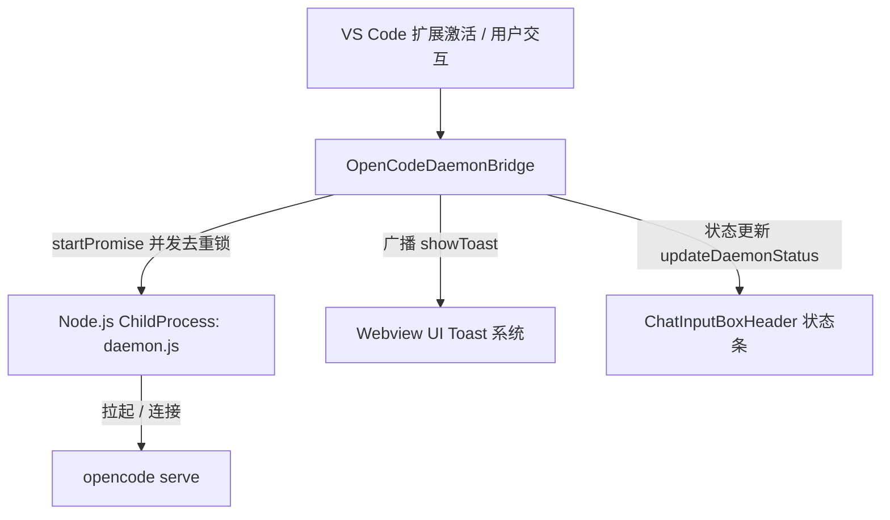

# OpenCode 服务生命周期与插件内 Toast 反馈机制

本文档详细说明 VS Code 扩展（`opencode-buddy`）中 **OpenCode Daemon 守护进程生命周期管理**、**输入框上方状态栏流转** 以及 **插件内 Toast 强提醒机制** 的设计与实现规范。

---

## 1. 系统架构与背景

`opencode-buddy` 采用**常驻守护进程（Daemon）**架构驱动底层的 `opencode serve` 服务，提供会话流式交互、模型列表获取、权限确认及历史记录管理。

---

## 2. 状态栏（Status Bar）平滑流转机制

### 2.1 问题与根因
- **问题**：过去打开插件时，输入框上方的状态栏（`ChatInputBoxHeader`）在出现「正在启动 OpenCode 服务...」后几毫秒内瞬间消失或直接跳到「OpenCode 服务未运行」，无法感知启动过程。
- **根因**：
  1. 扩展激活时，后台异步执行 `warmupDaemon()`，而 Webview 挂载后立即发送 `frontend_ready`。宿主在收到请求时仅检查 `isAlive()`，未判断 Daemon 是否正在启动中（`isStarting`），直接下发了 `{ alive: false }`。
  2. Webview 内部的 `isSdkInstalled` 历史遗留了对 CLI provider 恒为 `true` 的短路，导致收到 `{ alive: false }` 时错误地判定为状态正常而直接隐藏了警告条。

### 2.2 解决方案
1. **宿主异步等待（`sendDaemonStatus`）**：
   - 引入 `daemon.isStarting()` 状态判断。
   - 当检测到 Daemon 正处于启动或重启过程中时，先向 Webview 下发 `{ alive: true, serveReady: false }` 维持 Loading 状态。
   - `await daemon.start()` 决议完成后，再依据真实结果下发 `{ alive: true, serveReady: true }`（成功）或 `{ alive: false, serveReady: false }`（失败）。
2. **Webview 真实存活状态绑定**：
   - 移除 `isSdkInstalled` 的硬编码短路，直接绑定 `daemonAlive`。
   - 只有在 `alive: true && serveReady: true` 时状态栏才正常收起；若启动失败则保持展示带有「重试」按钮的黄色警告条。

---

## 3. 插件内 Toast 强提醒与去重机制

### 3.1 摒弃系统级弹窗，统一走插件内 Toast
- 启动失败（如 Node 环境异常、二进制缺失、语法错误等）不再使用 VS Code 右下角原生 `vscode.window.showErrorMessage`，而是通过 `WebviewBroadcaster.broadcastJavaScript('showToast', errorDetail)` 统一调度 Webview 内部的 UI Toast 系统。
- 直观展现具体报错原因，不输出无意义的“查看日志”冗余提示。

### 3.2 启动并发去重与重试静默（De-duplication & Silent Retry）
- **并发去重锁（`startPromise`）**：
  扩展激活预热、模型获取（`get_cli_models`）、双侧边栏初始化时若同时触发 `start()` / `ensureRunning()`，全部复用同一个 `startPromise`，确保全局只启动一次进程，单次启动失败只广播 **1 次** Toast。
- **自动重试静默**：
  在后台崩溃自愈重试期间（第 1/3、2/3、3/3 次）保持静默，不反复弹窗打扰用户；只有当自动重启次数彻底耗尽或用户手动点击重试失败时，才广播最终错误 Toast。
- **首屏早期消息挂起队列（`window.__pendingToasts`）**：
  在 React 组件挂载完成前到达的 Toast 消息会被暂存在 `window.__pendingToasts`，待组件就绪后安全回放，避免启动初期的致命错误丢失。

---

## 4. 关键 API 与数据流

| 模块 | 关键方法 / 字段 | 职责说明 |
|------|-----------------|----------|
| `OpenCodeDaemonBridge` | `isStarting(): boolean` | 判断 Daemon 是否正在启动或重启清理中 |
| `OpenCodeDaemonBridge` | `start(): Promise<boolean>` | 带 `startPromise` 去重锁的启动入口 |
| `OpenCodeDaemonBridge` | `showStartupErrorToast(detail)` | 格式化错误并向所有 Webview 广播 `showToast` |
| `WindowEventHandler` | `sendDaemonStatus()` | 处理 Webview 握手，平滑等待启动完成并下发状态 |
| `useUsageTracking` | `isSdkInstalled` / `daemonAlive` | 响应 `updateDaemonStatus` 并驱动前端状态条切换 |
