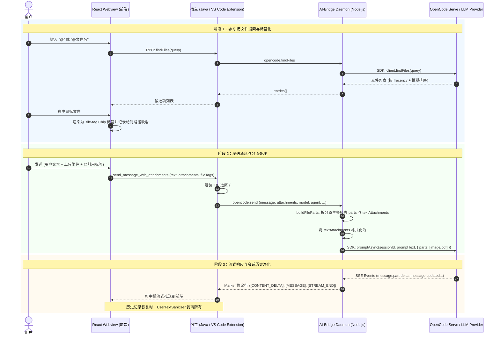

# OpenCode IDEA & VS Code 插件：文件识别、附件处理、@引用与文件上下文完整架构与排查指南

本文档系统阐述了在 **OpenCode IDEA GUI** 与 **OpenCode VS Code Plugin** 两个插件中，**上传附件（图片/PDF/代码/文本文件）**、**@ 引用文件（模糊搜索与标签化）**、**文件与 IDE 上下文（活动文件/选区/终端/工作区）** 以及 **提示词组装与历史记录净化** 的端到端完整实现原理与排查手册。

---

## 1. 核心概念与场景分工对比

在插件体系中，用户与文件的交互分为三大核心维度，各自承担不同的职责与底层传输策略：

| 维度 | 1. 📎 上传附件 (Attachments) | 2. 🔍 @ 引用文件 (Referenced Files) | 3. 💻 IDE 与文件上下文 (IDE Context) |
| :--- | :--- | :--- | :--- |
| **触发方式** | 点击输入框旁“📎 添加附件”、拖拽文件或剪贴板粘贴截图/文件 | 在输入框中键入 `@` 唤起项目文件补全下拉列表并回车选择 | 自动收集：当前活动编辑器文件、选中的代码行号范围、活动终端等 |
| **典型场景** | 项目外部文件、独立配置文件（如 `.env`）、临时日志、截图卡片 | 项目工作区内已有源码文件（如 `src/App.tsx`） | 当前正在阅读的代码片段、光标所在位置的函数 |
| **传输形式** | **内容快照传递**：<br>• 图片/PDF：原生多模态 `FilePartInput`<br>• 代码/文本：`<attachment filename="...">` 内联注入 | **路径引用传递**：<br>在 `## Referenced Files` 中注入文件绝对路径，由 Agent 调用 `Read` 工具按需从磁盘读取 | **路径与选区标记传递**：<br>在 `## IDE Context` 中注入路径与行号范围（如 `#L10-25`），Agent 按需读取 |
| **设计考量** | 外部文件不在磁盘工作区，必须携带内容快照；且文本文件不能作为 `data:text/plain` 多模态块发送给模型（会触发 400 错误） | 项目内文件如果每次都打出全文，会严重消耗上下文 Token 并超出提示词限制；路径传递让智能体自主按需阅读 | 精准告知模型用户当前视觉焦点所在，无需内联大段选中代码 |

---

## 2. 端到端架构与数据流图



---

## 3. 关键机制与深度技术实现

### 3.1 附件处理与 LLM API 400 错误根因及分流解决方案

#### 根因剖析
在 OpenCode SDK 中，`FilePartInput` 支持通过 `url: "data:<mime>;base64,..."` 传递文件。
然而，OpenCode Serve 会将此部分作为多模态媒体块（Media / Image Block）透传给上游大模型 API（如 Anthropic Claude API、OpenAI、DeepSeek 等）。
主流模型提供商的 API 严格限制多模态类型仅支持原生媒体：
- `image/jpeg`, `image/png`, `image/gif`, `image/webp`
- `application/pdf`（部分模型支持）

如果将 `.env`, `.gradle`, `.js`, `.json`, `.java`, `.txt` 等文本/代码文件封装为 `data:text/plain;base64,...`，上游 API 会直接报错：
`400 Invalid mime_type: 'text/plain'. Expected one of image/jpeg, image/png, image/gif, image/webp, application/pdf`。

#### 分流解决方案（`cli-image-input.js`）
在 AI-Bridge 层的 `buildFileParts` 中进行精准分流：
1. **原生多模态文件（`image/*` 与 `application/pdf`）**：
   - 生成 `parts: [{ type: "file", mime, filename, url: "data:..." }]`，通过模型原生多模态通道传输。
2. **代码与纯文本文件（`.env`, `.json`, `.ts`, `.java`, `.py`, `.sql` 等）**：
   - 解码 Base64 为 UTF-8 字符串，存入 `textAttachments`。
   - 调用 `formatInlinedAttachments` 将其格式化为结构化 Markdown 注入块：
     ```markdown
     ## Attached Files

     <attachment filename=".env">
     DATABASE_URL=postgres://localhost:5432/mydb
     API_KEY=sk_test_123456
     </attachment>
     ```
   - 拼接到 `promptText` 末尾。大模型能 100% 完整读取代码内容，且零 400 报错。
3. **不可读二进制文件（`.zip`, `.jar`, `.exe`, `.class`, `.so` 等）**：
   - 拦截并记录友好错误提示，避免向模型发送破坏性二进制乱码。

---

### 3.2 @ 引用文件机制 (Referenced Files)

1. **前端交互与光标保全**：
   - 用户键入 `@` 触发 `useCompletionTriggerDetection`。
   - 选中后 `useFileTags` 将选中的文件替换为 `<span class="file-tag" data-file-path="...">` 标签。
   - `virtualCursorUtils` 在 innerHTML 替换后恢复光标位置，防止光标跳动。
2. **元数据提取与注入**：
   - 前端提取 `fileTags: [{ displayPath, absolutePath }]` 随请求发送。
   - 宿主（Java `SessionContextService` / VS Code `OpenCodeSession`）生成：
     ```markdown
     ## Referenced Files

     The following files were referenced by the user:

     - `/path/to/src/index.ts`

     Read them with your file tools as needed; the user expects answers based on their content.
     ```
   - OpenCode 智能体通过自身的 `Read` 工具读取最新文件内容。

---

### 3.3 IDE 与文件上下文 (IDE Context)

在消息发送前，宿主自动收集用户的编辑器状态：
1. **活动文件与选区（Selection）**：
   - 若用户在编辑器中高亮选中了代码，生成：
     ```markdown
     ## IDE Context

     Active file: `/path/to/App.tsx#L15-30`

     The user has selected the referenced lines in this file; the selection is the primary subject of the user's question. Read the file to see the selected code.
     ```
2. **活动文件（Active File）**：
   - 若用户未选区，仅打开了某个文件：
     ```markdown
     ## User's Current IDE Context

     The user is viewing this file in their IDE. This is the PRIMARY SUBJECT of the user's question: `/path/to/App.tsx`
     ```
3. **多模块工作区与终端（Modules & Terminal）**：
   - 注入 `## Workspace Context`、`## Project Modules` 以及 `## Active Terminal Session`。

---

### 3.4 提示词净化与历史回放隔离 (`UserTextSanitizer`)

为了向模型提供完整上下文，所有 `##` 注入块都会随消息持久化存储到 OpenCode Serve 的会话历史中。
当重新加载会话或向前端渲染用户气泡时，`UserTextSanitizer` 会根据白名单标题剥离这些附加块：

```
INJECTED_SECTION_TITLES = [
  "## Workspace Context",
  "## Project Modules",
  "## Active Terminal Session",
  "## Referenced Files",
  "## Attached Files",
  "## IDE Context",
  "## User's Current IDE Context",
  "## Agent Role and Instructions"
]
```

- **UI 呈现效果**：
  - 用户消息气泡只显示用户最初输入的纯净文本（如 `请帮我看看这个配置`）；
  - `@` 引用的文件通过消息的 `fileTags` 渲染为 `@file` Chip；
  - 上传的附件通过消息的 `attachments` / `attachment` block 渲染为 `📎 Attachment` Chip；
  - 各组件展示互不干扰、井然有序。

---

## 4. 单元测试覆盖与验证清单

本体系在各层均配备了自动化单元测试：

| 测试文件 | 覆盖模块与测试内容 | 执行命令 |
| :--- | :--- | :--- |
| `ai-bridge/utils/file-parts.test.js` (IDEA & VS Code) | • 图片原生多模态 `parts` 构建<br>• 代码/文本文件 `textAttachments` 提取<br>• `formatInlinedAttachments` Markdown 生成<br>• 二进制文件拦截与错误处理<br>• 路径映射与空文本兜底 | `node --test utils/file-parts.test.js` |
| `SessionContextServiceTest.java` (IDEA) | • 图片生成 `image` block<br>• 文本附件生成 `attachment` block<br>• 混合附件构建<br>• `## Referenced Files` 路径注入（无大段内容内联）<br>• `## IDE Context` 选区行号标记注入 | `./gradlew test --tests *SessionContextServiceTest*` |
| `UserTextSanitizerTest.java` (IDEA) | • `## Attached Files` 剥离<br>• `## Referenced Files` / `## IDE Context` 剥离<br>• 多段落混合剥离与幂等性保障<br>• 用户自定义 Markdown 标题保留 | `./gradlew test --tests *UserTextSanitizerTest*` |
| `src/test/extension.test.ts` (VS Code) | • `UserTextSanitizer.ts` 剥离 `## Attached Files`<br>• 剥离 `## Referenced Files` 与 `## IDE Context`<br>• `needsSanitize` 检测判断 | `npm run compile` / VS Code Test Runner |

---

## 5. 常见问题排查手册 (Troubleshooting)

### Q1: 上传代码或文本文件后，大模型报错 `Invalid mime_type: text/plain`
- **原因**：宿主或 AI-Bridge 将文本文件作为 `url: data:text/plain;base64,...` 的 FilePart 发送给了模型多模态通道。
- **排查与确认**：检查 `ai-bridge/utils/cli-image-input.js` 中的 `buildFileParts` 是否启用了 `textAttachments` 提取与 `formatInlinedAttachments` 注入逻辑。

### Q2: 上传附件后模型回答“我没有收到任何文件内容”
- **原因**：宿主未将非图片附件加入到发送 payload 中，或未格式化为 `<attachment>` 标签注入到 prompt。
- **排查与确认**：检查 IDEA 端 `SessionContextService.java` 的 `buildUserMessage` 是否包含 `createAttachmentBlock(att)`，以及 Daemon 端的 `sendMessagePersistent` 是否调用了 `formatInlinedAttachments`。

### Q3: 历史会话恢复后，用户聊天气泡里出现了大段 `## Referenced Files` 或 `## Attached Files`
- **原因**：`UserTextSanitizer` 缺少对应的段落标题定义。
- **排查与确认**：检查 Java 端 `UserTextSanitizer.java` 和 TS 端 `UserTextSanitizer.ts` 的 `INJECTED_SECTION_TITLES` 列表中是否包含 `"## Attached Files"`。

