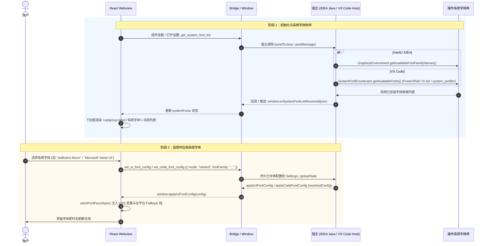

# OpenCode 字体系统、外观设置与跨平台 UI 图标文字对齐架构设计文档

本文档系统阐述了在 **OpenCode IDEA GUI** 与 **OpenCode VS Code Plugin** 双端插件中，**系统字体动态枚举与配置**、**宿主专属外观设置（跟随 IDE / 跟随 VS Code）** 以及 **Windows / Linux 跨平台图标与字体垂直错位修复** 的完整技术实现方案与架构设计。

---

## 1. 架构总览与交互时序

整个字体系统与外观设置链路涵盖 **宿主层系统字体枚举**、**桥接层异步分发**、**Webview 响应式状态管理与下拉渲染**、**动态 CSS 样式注入** 以及 **全平台 CJK 字体度量与图标垂直对齐加固**。

### 1.1 系统字体加载与切换时序图



---

## 2. 核心问题根因分析与技术方案

### 2.1 宿主文案差异化（跟随 IDE vs 跟随 VS Code）

#### 问题现象
在 VS Code 插件中，外观设置、通知设置、界面语言等选项中出现大量“跟随 IDE”或“跟随 IDEA”字样，割裂了 VS Code 用户的交互体验。

#### 解决方案
双端 Webview 为独立工程架构，在 VS Code 插件专属多语言资源包（`webview/src/i18n/locales/zh.json`、`en.json`、`zh-TW.json`）中，对所有外观与系统集成文案进行精准修正：
- 主题模式：`跟随 IDE` → `跟随 VS Code`
- 界面语言：`跟随 IDE` → `跟随 VS Code`
- 界面字体：`跟随 IDE (当前: {font})` → `跟随 VS Code (当前: {font})`
- 代码字体：`跟随编辑器 (当前: {font})`
- 通知/声音：`IDE 处于非活动状态时播放声音` → `VS Code 处于非活动状态时播放声音`

---

### 2.2 系统字体全链路枚举与恢复

#### 问题现象
在外观设置中，原有的系统字体选项丢失，仅剩“跟随编辑器”与“自定义字体文件”两种模式，无法直接选择操作系统内置字体。

#### 解决方案与实现链路

1. **宿主层枚举实现**:
   - **IDEA Java 端** (`FontConfigService.java`):
     ```java
     public static List<String> getSystemFontFamilies() {
         String[] names = GraphicsEnvironment.getLocalGraphicsEnvironment().getAvailableFontFamilyNames();
         List<String> list = new ArrayList<>();
         for (String name : names) {
             if (name != null && !name.trim().isEmpty() && !name.startsWith(".")) {
                 list.add(name.trim());
             }
         }
         Collections.sort(list, String.CASE_INSENSITIVE_ORDER);
         return list;
     }
     ```
   - **VS Code 端** (`SystemFontEnumerator.ts`):
     跨平台调用底层系统 API 或 CLI (`PowerShell DirectWrite / Registry`, `fc-list`, `system_profiler`) 获取字体家族并做内存级 LRU 缓存。

2. **通信协议与消息处理**:
   - Webview 发起请求：`sendToJava("get_system_font_list:")` / `vscode.postMessage({ command: "get_system_font_list" })`。
   - 宿主响应：调用 `window.onSystemFontListReceived(JSON.stringify({ fonts: [...], source: "host" }))`。

3. **Webview 状态与下拉渲染**:
   - `useSettingsBasicActions.ts` 维护 `systemFonts: string[]` 状态。
   - `AppearanceTab.tsx` 区分渲染：
     ```tsx
     <select value={selectedUiFontOption} onChange={handleUiFontSelectionChange}>
       <option value="followEditor">
         {t("settings.basic.editorFont.followOption", { font: uiFontConfig?.fontFamily || "-" })}
       </option>
       {uiFontConfig?.mode === "named" && uiFontConfig.fontFamily && !systemFonts.includes(uiFontConfig.fontFamily) && (
         <option value={`named:${uiFontConfig.fontFamily}`}>{uiFontConfig.fontFamily}</option>
       )}
       {systemFonts && systemFonts.length > 0 && (
         <optgroup label={t("settings.basic.editorFont.systemFontsGroup")}>
           {systemFonts.map((font) => (
             <option key={`ui-font-${font}`} value={`named:${font}`}>{font}</option>
           ))}
         </optgroup>
       )}
       <option value="customFile">
         {customFontFileName ? `${t("settings.basic.editorFont.customOption")} / ${customFontFileName}` : t("settings.basic.editorFont.customOption")}
       </option>
     </select>
     ```
   - 选择系统字体时，向后端发送 `{ mode: "named", fontFamily: fontName }`。

---

### 2.3 Windows / Linux 设备下图标与文字错位修复

#### 问题根因分析

在 Windows 与 Linux 环境下，用户经常遇到“文字相对左侧 Codicon 图标向上浮起 1~2px”的视觉不对齐现象：

```
错位表现 (未修复前):
┌──────┐  ┌─────────────┐
│ 图标 │  │ 向上浮起的文本 │ (基线不齐，文本偏上)
└──────┘  └─────────────┘
```

**深入根因**:
1. **西文字体先序命中的行盒基线偏移**:
   CSS 字体栈中若将西文字体（如 `Segoe UI`、`Inter`、`Ubuntu`）排在 CJK 字体之前，西文字体的度量参数（Ascender、Descender、LineGap）先行决定了行盒（Inline Formatting Context）的基线高度。当行内渲染中文汉字时，中文字形的垂直中心点与西文基线无法对齐，导致中文字符整体上浮。
2. **`.codicon` 字体图标度量缺失**:
   VS Code Codicons 字体默认按字体字形渲染，缺少 `display: inline-flex` 和明确的基线对齐约束。在不同 DPI 缩放比例下，行高（`line-height`）被父级继承，造成图标与相邻文字的 `vertical-align` 发生偏移。

#### 修复方案

1. **全平台对称度量字体栈注入 (`base.less` / `main.tsx`)**:
   ```less
   --cc-gui-ui-font-family: -apple-system, BlinkMacSystemFont, "Segoe UI", Roboto,
     "Helvetica Neue", Arial, "Microsoft YaHei UI", "Microsoft YaHei",
     "PingFang SC", "Hiragino Sans GB", "Noto Sans CJK SC", "WenQuanYi Micro Hei",
     sans-serif, "Apple Color Emoji", "Segoe UI Emoji", "Segoe UI Symbol";
   ```
   在 `appendSansSerifFallback` 中强制将包含 `Microsoft YaHei UI`、`Noto Sans CJK SC` 的对称度量栈追加在所有用户字体之后，保证跨平台中西文混排具有均衡的 Ascent / Descent 比例。

2. **`.codicon` 样式规范与垂直居中加固 (`codicon.css`)**:
   ```css
   .codicon {
     font-family: "codicon" !important;
     display: inline-flex;
     align-items: center;
     justify-content: center;
     vertical-align: middle;
     line-height: 1;
     flex-shrink: 0;
     font-style: normal;
     font-weight: normal;
     font-variant: normal;
     text-transform: none;
     text-rendering: auto;
     text-align: center;
     -webkit-font-smoothing: antialiased;
     -moz-osx-font-smoothing: grayscale;
     user-select: none;
   }
   ```

3. **设置项容器布局规范 (`BasicConfigSection/style.module.less`)**:
   ```less
   .fieldHeader {
     display: flex;
     align-items: center;
     gap: 6px;
     margin-bottom: 6px;
     line-height: 1.4;

     :global(.codicon) {
       font-size: 14px;
       width: 14px;
       height: 14px;
       line-height: 1;
       vertical-align: middle;
       display: inline-flex;
       align-items: center;
       justify-content: center;
       flex-shrink: 0;
     }
   }

   .fieldLabel {
     font-size: 13px;
     font-weight: 500;
     color: var(--vscode-foreground, #cccccc);
     line-height: 1.4;
     display: inline-flex;
     align-items: center;
   }
   ```

---

## 3. 单元测试与验证矩阵

### 3.1 IntelliJ IDEA 插件端测试

- **`FontConfigServiceUiFontResolutionTest.java`**:
  - `shouldReturnSystemFontFamiliesAndJson`: 验证 Java 宿主系统字体枚举及 JSON 结构生成。
  - `shouldResolveUiNamedFontMode`: 验证 `mode="named"` 下 UI 字体正确解析与生效。
  - `shouldFallBackToEditorWhenUiNamedFontFamilyIsBlank`: 验证空字体名称安全回退为 `followEditor`。
  - `shouldResolveCodeNamedFontMode`: 验证 `mode="named"` 下代码字体正确解析。
  - `shouldFallBackToEditorWhenCodeNamedFontFamilyIsBlank`: 验证代码字体空白名称回退机制。
- **执行命令**: `./gradlew test` (656+ 测试全部通过)

### 3.2 Webview 前端测试

- **`AppearanceTab.test.tsx`**:
  - `renders system fonts in an optgroup and triggers selection changes`: 验证 `<optgroup label="系统字体">` 渲染与 `named:` 选项变更派发。
  - `displays named mode font family in the ui and code font hint`: 验证初始配置为 `named` 模式时的选中状态与文案提示。
- **`useSettingsBasicActions.test.ts`**:
  - `sends named font configuration updates for ui and code font selections`: 验证 UI 字体与代码字体选择系统字体时的协议报文封装。
  - `does not send anything when switching to customFile without a saved path (silent no-op)`: 验证无路径时的静默防抖保护。
- **执行命令**: `npm test` (双端 100% 通过)

---

## 4. 架构总结

| 模块 | 负责内容 | 关键技术点 |
| :--- | :--- | :--- |
| **Java / Host 宿主** | 系统字体扫描与偏好存储 | `GraphicsEnvironment` / `SystemFontEnumerator` 跨平台枚举 |
| **Bridge 协议层** | 双向消息分发 | `get_system_font_list` / `onSystemFontListReceived` |
| **React Webview** | 状态管理与分组渲染 | `<optgroup>` 分组展示、`mode: "named"` 状态持久化 |
| **CSS / Typography** | 跨平台排版与对齐加固 | 对称 CJK 字体栈、`.codicon` `inline-flex` 垂直居中 |
