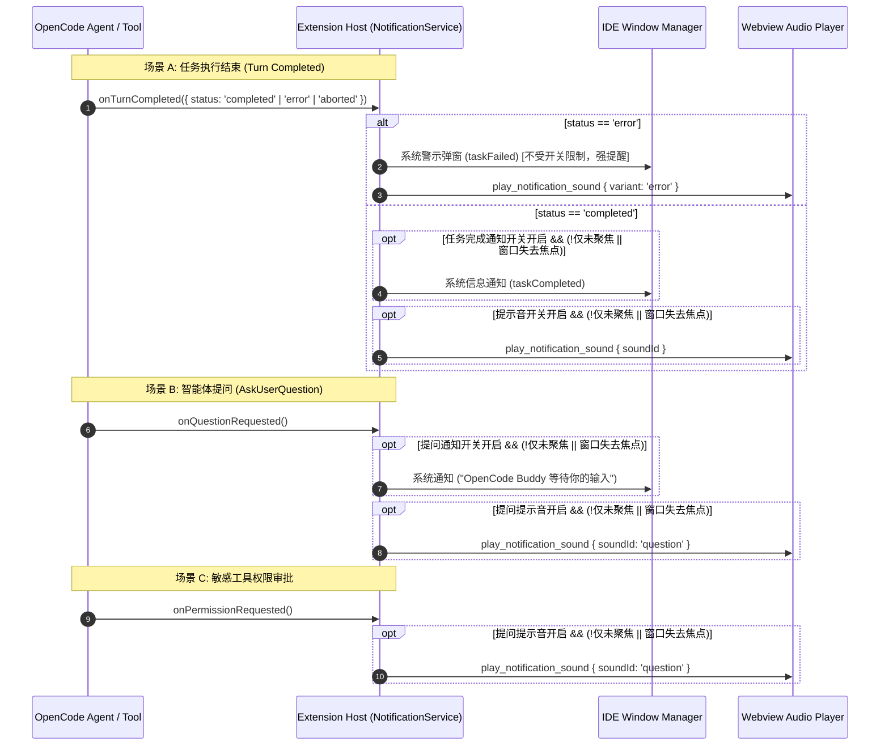

# 多语言（i18n）与系统通知设计与实现规范

本文档详述 OpenCode IDEA 插件与 VS Code 插件中 **多语言国际化（i18n）体系、系统通知（Notification）与声音提示（Sound）分发机制、以及 "OpenCode Buddy" 全局品牌一致性** 的架构设计与工程规范。

---

## 一、背景与设计目标

### 1. 品牌与文案统一
在插件从早期的单一模型演进为支持多 Provider 的 **OpenCode Buddy** 期间，部分宿主层通知（如 AskUserQuestion 提问提示、任务完成通知、状态栏 Tooltip 等）曾残留“Claude 有问题要问”或“Claude Provider”等遗留文案。
本次重构彻底规范了双端所有多语言资源，将所有用户可见的通知、状态与交互提示统一标准化为 **OpenCode Buddy**。

### 2. 全 10 种语言支持矩阵
双端全面对齐支持以下 10 种国际化语言：
1. **简体中文** (`zh`)
2. **繁体中文** (`zh-TW`)
3. **English** (`en`)
4. **Español** (`es`)
5. **Français** (`fr`)
6. **日本語** (`ja`)
7. **Русский** (`ru`)
8. **हिन्दी** (`hi`)
9. **한국어** (`ko`)
10. **Português (Brasil)** (`pt-BR`)

---

## 二、双端三层多语言（i18n）架构设计

双端插件均采用“**前端 Webview + 宿主 Host 协同**”的三层多语言架构：

```
+-----------------------------------------------------------------------------------+
|                                 用户界面 / 操作交互                                |
+-----------------------------------------------------------------------------------+
                                         │
        ┌────────────────────────────────┴────────────────────────────────┐
        ▼                                                                 ▼
+──────────────────────────────────+             +──────────────────────────────────+
|        前端 Webview 层 (React)     |             |         宿主 Host 层 (Java/TS)    |
| • 引擎: i18next + react-i18next  |             | • IDEA: ResourceBundle (9 属性包) |
| • 语言表: 10 种语言独立 JSON       |             | • VS Code: NotificationCopy (10) |
| • 职责: 渲染对话/设置/卡片/UI      |             | • 职责: 系统弹窗/状态栏/通知/托盘  |
+──────────────────────────────────+             +──────────────────────────────────+
        ▲                                                                 ▲
        └────────────────────────────────┬────────────────────────────────┘
                                         │
                         +───────────────────────────────+
                         |       权威语言决策与同步机制      |
                         | 1. 用户显式设置 (优先)          |
                         | 2. IDE 宿主语言环境 (智能映射)    |
                         | 3. 英文默认回退 ('en')          |
                         +───────────────────────────────+
```

### 1. 前端 Webview 层
- 采用 `i18next` 与 `react-i18next`；
- 在 `webview/src/i18n/locales/` 下维护 10 种语言的命名空间 JSON；
- 前端启动时，通过 `frontend_ready` 握手向宿主请求权威语言配置，宿主下发 `applyIdeaLanguageConfig` 指令，前端无缝切换并本地持久化。

### 2. IDEA 宿主层 (`opencode-idea-gui`)
- 采用 JetBrains 官方 `DynamicBundle` 方案：`OpenCodeBuddyBundle`；
- 在 `src/main/resources/messages/` 目录下维护属性文件：
  - `OpenCodeBuddyBundle.properties` (默认英文)
  - `OpenCodeBuddyBundle_zh.properties` (简体中文)
  - `OpenCodeBuddyBundle_zh_TW.properties` (繁体中文)
  - `OpenCodeBuddyBundle_en.properties` (英文)
  - `OpenCodeBuddyBundle_es.properties` (西班牙语)
  - `OpenCodeBuddyBundle_fr.properties` (法语)
  - `OpenCodeBuddyBundle_ja.properties` (日语)
  - `OpenCodeBuddyBundle_ru.properties` (俄语)
  - `OpenCodeBuddyBundle_hi.properties` (印地语)
- 自动适配 IDE 界面语言或用户在插件设置页中选定的语言。

### 3. VS Code 宿主层 (`opencode-vscode-plugin`)
- VS Code 扩展宿主运行在独立的 Node.js 进程中，无法直接访问前端 Webview 的 i18next 内存实例；
- 宿主在 `src/host/notifications/NotificationCopy.ts` 中维护轻量解耦的 10 语言文案表 `COPY` 与纯函数解析器；
- 通过 `resolveCopyKey(userLanguage, vscode.env.language)` 动态获取当前应使用的语言，无需重启插件即可实时响应。

---

## 三、系统通知（Notification）与声音提示（Sound）流程



### 门控规则（Gating Matrix）

| 事件类型 | 系统通知（System Notification）门控 | 声音提示（Sound）门控 | 品牌与文案 |
| :--- | :--- | :--- | :--- |
| **任务成功完成** | `taskCompletionNotificationEnabled` 且满足焦点门控 | `soundNotificationEnabled` 且满足焦点门控 | `taskCompleted` ("任务已完成") |
| **任务执行出错** | **强制弹出**（不受开关影响，确保用户知晓失败） | `soundNotificationEnabled`（播放专用警示低音） | `taskFailed` ("任务执行出错") |
| **AskUserQuestion** | `askUserQuestionNotificationEnabled` 且满足焦点门控 | `askUserQuestionSoundNotificationEnabled` | `questionPending` ("OpenCode Buddy 等待你的输入") |
| **敏感权限请求** | 仅卡片呈现（避免与提问系统通知产生重复噪音） | 共用 `askUserQuestionSoundNotificationEnabled` | 权限确认弹窗统一标记 `OpenCode Buddy` |

---

## 四、语言归一化与智能映射规范（Locale Normalization）

为了兼容各种 IDE 返回的语言标识（如 `zh-cn`, `zh-Hans-CN`, `zh_TW`, `pt_BR`, `es-419` 等），双端实现了标准化的映射算法：

```ts
export function mapIdeLanguageToSupported(ideLanguage: string): string {
    const lower = (ideLanguage ?? '').trim().toLowerCase();
    if (!lower) return 'en';
    
    // 1. 完全匹配
    const exact = SUPPORTED_LANGUAGES.find((l) => l.toLowerCase() === lower);
    if (exact) return exact;

    // 2. 中文变体智能归一
    if (lower.startsWith('zh')) {
        return /tw|hk|mo|hant/.test(lower) ? 'zh-TW' : 'zh';
    }

    // 3. 前缀匹配（如 es-ES -> es, pt-BR -> pt-BR）
    const base = lower.split(/[-_]/)[0];
    return SUPPORTED_LANGUAGES.find((l) => l.toLowerCase() === base) ?? 'en';
}
```

---

## 五、质量保障与自动化测试体系

为防止后续版本迭代再次出现品牌倒退或多语言缺失，建立了双端严格的单测守护：

### 1. IDEA 插件自动化测试 (`OpenCodeBuddyBundleI18nTest.java`)
- **资源完整性测试**：遍历全部 9 个 `.properties` 属性包，校验关键键（`notifier.*`, `status.*` 等）100% 存在且非空；
- **品牌零污染校验**：遍历所有通知与状态文本，正则断言**禁止包含 "Claude"**，并且**必须包含 "OpenCode Buddy"**。

### 2. VS Code 插件自动化测试 (`NotificationService.test.ts` & `extension.test.ts`)
- **10 语言全覆盖测试**：断言 `COPY` 常量表包含全部 10 种语言的 `taskCompleted`, `taskFailed`, `questionPending`；
- **品牌合规测试**：对 10 种语言的通知文本进行品牌校验（无 Claude、规范使用 OpenCode Buddy）；
- **解析优先级与回退测试**：覆盖用户设置优先、IDE 语言回退、未知语言 fallback 到 `en`、复杂 locale 字符串解析等 15+ 边界场景。

