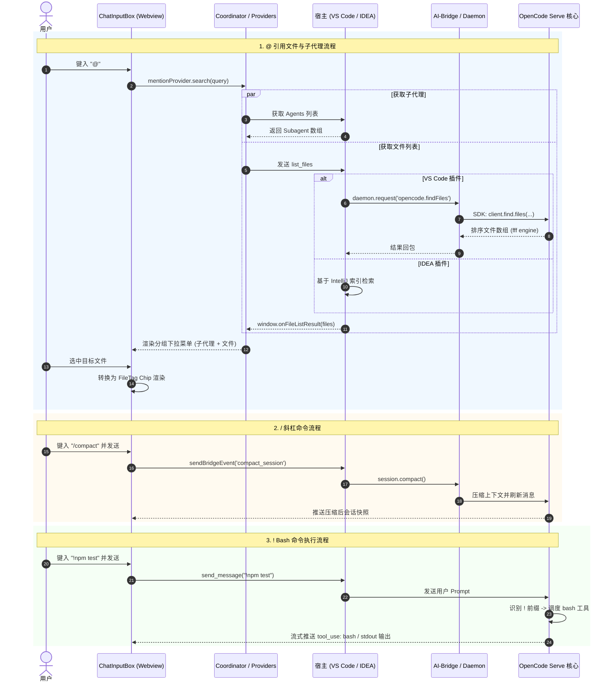

# 输入指令与引用系统技术文档 (@ / ! / /)

本文档系统性梳理 OpenCode 插件（IDEA & VS Code）在聊天输入框（ChatInputBox）中提供的三大核心交互前缀：**`@` 引用文件与子代理**、**`!` 直接执行 Bash 终端命令**、**`/` OpenCode 斜杠命令** 的完整功能逻辑、数据流转生命周期、双端实现差异及排查指南。

---

## 目录

1. [整体架构与交互总览](#1-整体架构与交互总览)
2. [@ 引用文件与子代理 (Mention & File References)](#2--引用文件与子代理-mention--file-references)
   - 2.1 触发与补全协调器
   - 2.2 数据提供器架构 (`mentionProvider`)
   - 2.3 宿主端文件获取机制 (VS Code vs IDEA)
   - 2.4 文件 Tag 渲染与发送编译
3. [! 执行 Bash 终端命令 (Direct Shell Execution)](#3--执行-bash-终端命令-direct-shell-execution)
   - 3.1 指令触发与意图识别
   - 3.2 终端工具调度与流式输出
4. [/ OpenCode 斜杠命令 (Slash Commands)](#4--opencode-斜杠命令-slash-commands)
   - 4.1 命令提供器与分组聚合
   - 4.2 本地拦截与后端分流执行
5. [数据流与调用时序图](#5-数据流与调用时序图)
6. [常见问题排查与 FAQ](#6-常见问题排查与-faq)

---

## 1. 整体架构与交互总览

输入框在占位提示（Placeholder）中明确引导了三种交互模式：
> `@引用文件，!执行 bash 命令，/opencode 命令，Enter 发送`

```text
┌─────────────────────────────────────────────────────────────────────────────┐
│                             ChatInputBox                                    │
│                                                                             │
│  输入 @  ───►  [mentionProvider]       ───►  子代理分组 + 文件模糊搜索列表      │
│  输入 !  ───►  [Direct Bash Mode]      ───►  直达终端工具 (bash / exec_cmd)  │
│  输入 /  ───►  [slashCommandProvider]  ───►  内置/会话/SDK 动态斜杠命令列表   │
└─────────────────────────────────────────────────────────────────────────────┘
```

---

## 2. @ 引用文件与子代理 (Mention & File References)

### 2.1 触发与补全协调器
- **组件/Hook**：`useChatInputCompletionsCoordinator.ts`
- **触发检测**：用户在输入框中输入 `@` 时，`useCompletionTriggerDetection` 计算光标相对位置并开启浮层。
- **差异化插入逻辑**：
  - **选中子代理 (`kind === 'subagent'`)**：插入纯文本 `@agentName `，光标移至末尾，不转化为 DOM FileTag。
  - **选中文件 (`kind === 'file'`)**：
    1. 文本替换为 `@/path/to/file `；
    2. 注册路径映射至 `pathMappingRef`（存储 `name -> absolutePath`，`relativePath -> absolutePath`）；
    3. 调用 `useFileTags` 将 DOM 中的 `@path` 解析并替换为带有专属图标和样式的 `<span class="file-tag" data-file-path="...">` 视觉 Chip。

---

### 2.2 数据提供器架构 (`mentionProvider`)
- **文件位置**：`mentionProvider.ts`
- **并发聚合**：
  ```typescript
  export async function mentionProvider(query: string, signal: AbortSignal): Promise<MentionItem[]> {
    const [files, subs] = await Promise.all([
      fileReferenceProvider(query, signal).catch(() => []),
      subagentMentionProvider(query, signal).catch(() => []),
    ]);
    // 渲染带有分组标题（Section Header）的统一列表：先展示子代理，后展示文件
  }
  ```

---

### 2.3 宿主端文件获取机制 (VS Code vs IDEA)

#### ① VS Code 插件（优先 OpenCode SDK）
- **实现位置**：`src/host/handlers/FileHandler.ts` 与 `ai-bridge/services/opencode/opencode-sdk-client.js`
- **主通道（OpenCode SDK）**：
  1. Webview 发送 `list_files` 请求；
  2. 宿主向 Daemon 发起 `opencode.findFiles` RPC；
  3. `ai-bridge` 经由 `@opencode-ai/sdk/v2` 调用标准方法：
     ```javascript
     const result = await getClient().find.files({ query, limit, directory });
     ```
  4. OpenCode Serve 侧内置的 fff / ripgrep 引擎返回已按照**使用频次（frecency）与模糊度**排序的文件列表。
- **本地兜底通道**：
  - 若 Daemon 未启动或 OpenCode 服务离线，自动降级至本地 `vscode.workspace.findFiles` 结合当前打开的 Editor Tabs 进行快速收集。

#### ② IDEA 插件（IntelliJ 平台原生索引）
- **实现位置**：`FileHandler.java`
- **收集流水线**：
  - **Priority 0**：活跃 Terminals 与 Running Services；
  - **Priority 1**：当前在编辑器中打开的文件（`FileEditorManager`）；
  - **Priority 2**：最近打开的文件历史（`EditorHistoryManager`）；
  - **Priority 3**：基于 IntelliJ VirtualFileManager 与 FileIndex 的本地文件树检索。

---

### 2.4 文件 Tag 渲染与发送编译
当用户按下 Enter 发送时：
1. **DOM 解析**：`useMessageSender.ts` 从输入框提取纯文本与包含在其中的 `fileTags`（`{ displayPath, absolutePath }`）。
2. **Payload 构造**：通过 Bridge 向后端传递带有 `fileTags` 的 JSON 负载。
3. **模型上下文注入**：后端在向模型发送 prompt 时，将引用的文件路径及内容构造为上下文块，确保模型能够完整读取被 `@` 文件的准确代码。

---

## 3. ! 执行 Bash 终端命令 (Direct Shell Execution)

### 3.1 指令触发与意图识别
- **设计目标**：无需脱离聊天窗口，直接通过 `!command` 快速在项目根目录运行命令（例如 `!pwd`, `!git status`, `!npm test`）。
- **流程**：
  1. 用户在输入框以 `!` 开头输入指令（如 `!pwd what are you doing`）。
  2. 消息作为用户 Prompt 正常发送给 OpenCode 模型。
  3. OpenCode 识别到 `!` 前缀或终端执行意图，自动调用终端工具（`bash`, `execute_command`, `run_terminal_cmd` 等）。

### 3.2 终端工具调度与流式输出
- **流式接收**：Daemon 在执行过程中逐块下发 `tool_use`、`stdout` 与 `stderr` 内容。
- **前端收敛**：
  - Webview 端 `ContentBlockRenderer.tsx` 与 `BashToolGroupBlock.tsx` 自动将连续的 bash 命令聚合展示。
  - 支持输出日志实时滚动高亮、退出码（Exit Code）展示、耗时统计以及一键重新运行。

---

## 4. / OpenCode 斜杠命令 (Slash Commands)

### 4.1 命令提供器与分组聚合
- **实现位置**：`slashCommandProvider.ts`
- **命令来源聚合**：
  1. **本地系统命令 (`Local Commands`)**：
     - `/clear` / `/new` / `/reset`：清空当前会话，新建独立对话。
  2. **内置核心命令 (`Builtin Commands`)**：
     - `/compact`：触发当前会话上下文压缩总结；
     - `/undo` / `/redo`：撤销/重做最近的代码与状态变更；
     - `/fork`：分叉当前会话到新分支；
     - `/share` / `/unshare`：导出与分享会话网页；
     - `/init`：初始化 OpenCode 仓库配置；
     - `/models` / `/themes` / `/help`：快速呼出模型切换、主题切换与帮助手册。
  3. **OpenCode SDK 动态命令 (`SDK/Skill Commands`)**：
     - 从 OpenCode Serve 实时加载用户自定义的 Skills、Workflows、Prompts 与 MCP 扩展指令。

---

### 4.2 本地拦截与后端分流执行
在 `useMessageSender.ts` 中，对输入的斜杠命令进行三级分流：

```text
用户输入 "/command"
   │
   ├─► 命中本地前端指令 (/clear, /resume, /plan)
   │     └─► 直接调用前端控制器 (forceCreateNewSession, setCurrentView('history'))
   │
   ├─► 命中内置会话命令 (/compact, /undo, /redo, /fork)
   │     └─► 发送专有 Bridge RPC (compact_session, revert_message, fork_session)
   │
   └─► 命中通用/自定义斜杠命令 (/init, /custom-skill, ...)
         └─► 发送 session.command 或作为标准 command-message 交付 OpenCode 执行
```

---

## 5. 数据流与调用时序图



---

## 6. 常见问题排查与 FAQ

### Q1: VS Code 中输入 `@` 只有子代理，没有文件列表？
- **排查点**：
  1. 查看控制台日志中是否有 `[FileHandler][ai-bridge]` 相关报错。
  2. 确认 `ai-bridge/services/opencode/opencode-sdk-client.js` 中是否使用了标准 `getClient().find.files(...)`，而非已废弃的 `getClient().v2.fs.find`。
  3. 确认 OpenCode Serve 守护进程是否正常存活且端口（默认 4096）可达。

### Q2: 选中的文件在输入框内显示为纯文本而非蓝色 Chip？
- **排查点**：
  1. 确认选中的是文件还是子代理：子代理故意保留为纯文本 `@agentName`，仅文件会转化为带有 `data-file-path` 的 `file-tag`。
  2. 检查 `useFileTags.ts` 中的正则匹配规则是否覆盖了操作系统的文件路径分隔符（Windows `\` 与 POSIX `/`）。

### Q3: 斜杠命令下拉框提示“正在加载中”或超时？
- **排查点**：
  1. 检查宿主是否在页面初始化时正确触发了 `window.updateSlashCommands(...)`。
  2. 检查是否有网络阻塞导致从 OpenCode Serve 拉取 Slash Commands 超时。
