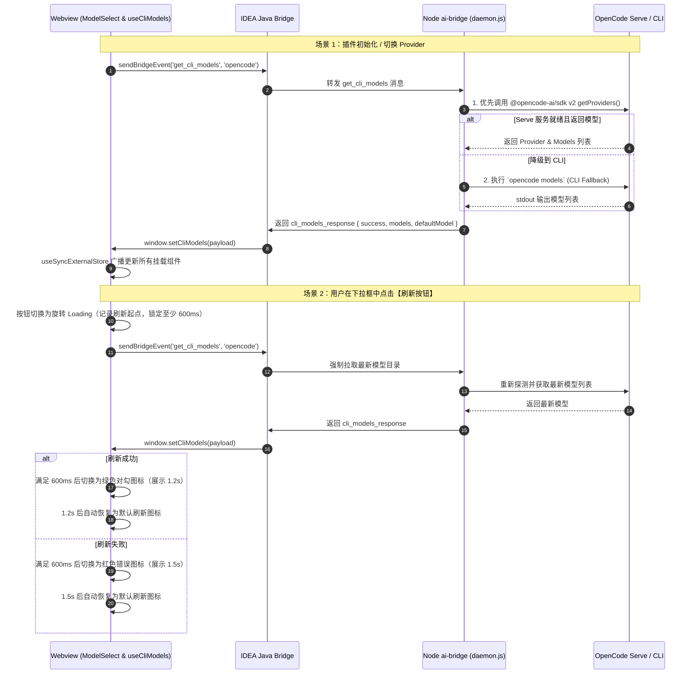

# OpenCode 模型列表功能与全链路流转设计

本文档系统阐述 **OpenCode IDEA GUI** 插件中模型列表（Model Catalog）功能的端到端架构设计、数据时序、分层实现、状态管理、内置动效交互及单元测试覆盖方案。

---

## 1. 架构总览与时序设计

模型列表采用 **Webview (React) $\leftrightarrow$ Java Bridge (JCEF 宿主) $\leftrightarrow$ Node.js ai-bridge (Daemon) $\leftrightarrow$ OpenCode Serve / CLI** 的四层响应架构。



---

## 2. 分层架构与核心机制

### 2.1 Node.js 守护进程层 (`ai-bridge/services/opencode/models-service.js`)

1. **SDK 优先发现与服务探测**：
   - 优先通过 `ensureServerReady()` 确保 `opencode serve` 本地服务正常监听。
   - 调用 `@opencode-ai/sdk` 的 `config.providers()` 接口获取已配置厂商及模型。
   - 解析厂商全局默认模型 `provider._defaults`，生成统一格式 `providerID/modelID`。
2. **CLI 子进程降级（Legacy Fallback）**：
   - 若 SDK 接口异常，自动通过 `resolveOpenCodeCliPath()` 定位系统中的 OpenCode CLI 并执行 `opencode models`。
   - 智能清洗 Windows CRLF、ANSI 终端彩色转义字符、过滤非模型路径（如 UNC 路径、Windows 盘符路径、文档 URL）。
3. **模型元数据归一化（Normalization）**：
   - **`contextWindow`（上下文窗口）**：解析 `models.dev` 的 `limit.context` 额度（如 1M、200K），透传至前端用于用量环和上下文徽标显示。
   - **`variants`（推理力度档位）**：解析模型支持的思考深度档位（如 `low` / `medium` / `high` / `max`），前端据此动态渲染推理选项。
   - **`description`**：标准化展示模型名称与厂商信息。

### 2.2 Java 宿主通信层 (`OpenCodeBridge`)

- 作为 Webview 与 Node Daemon 之间的双向事件管道。
- 接收 Webview 的 `get_cli_models` 调用，将请求分发给 Node 守护进程。
- 守护进程响应后，通过 JCEF `CefBrowser.executeJavaScript` 触发前端 `window.setCliModels`。
- 支持冷启动阶段的预注入挂载（`window.__pendingCliModels`）。

### 2.3 Webview 前端层 (`webview/src/hooks/providers/useCliModels.ts`)

1. **全局单例 Store 与响应式同步**：
   - 采用 React `useSyncExternalStore` 管理模型全局状态。
   - 彻底解决多个组件独立调用 Hook 导致状态覆盖或状态脱节问题（`App.tsx`、`ChatInputBox`、`ButtonArea` 共享唯一事实源）。
2. **防重与请求去重**：
   - 模块级缓存已拉取的模型数据，避免页面反复切换（如历史记录 $\leftrightarrow$ 聊天）时重复请求后端。
   - 支持超时保护（15s 超时自动熔断并回退至基础模型列表）。
3. **按钮内置状态机与交互动效 (`ModelSelect.tsx`)**：
   - 放弃全局弹窗 Toast，在刷新按钮内部建立有限状态机：
     $$\text{idle} \xrightarrow{\text{点击}} \text{loading} \xrightarrow{\text{完成}} \text{success (1.2s)} / \text{error (1.5s)} \xrightarrow{\text{重置}} \text{idle}$$
   - **最小视觉保护机制（Min-Spin Guarantee）**：设定 600ms 最小动画时长，即便底层接口在 20ms 内极速返回，用户仍能清晰观察到旋转反馈与成功对勾。
   - **下拉列表防闪烁**：刷新过程中保留已有列表项，不展示白屏或全列表骨架，仅在列表为空时才显示列表级 Loading。
4. **模型分组与置顶功能 (`modelSelectUtils.ts`)**：
   - 支持基于 `provider/model` 前缀的自动厂商分组（如 `anthropic`、`deepseek`、`opencode` 等）。
   - 支持模型置顶（Pinned），置顶项自动排列在下拉列表最顶部，并通过配置持久化保存。

---

## 3. 核心接口与数据结构

### 3.1 模型对象结构 (`ModelInfo`)

```typescript
export interface ModelInfo {
  id: string;              // 唯一标识，如 "anthropic/claude-sonnet-4-6" 或 "deepseek/deepseek-v4-pro"
  label: string;           // 显示名称，如 "Claude-Sonnet-4-6"
  description?: string;     // 描述文本
  variants?: string[];     // 推理力度档位，如 ["low", "high", "max"]
  contextWindow?: number;  // 上下文窗口大小（Token 数），如 1000000
}
```

### 3.2 桥接通信 Payload

**前端请求 (`get_cli_models`)**：
```json
"opencode"
```

**后端响应 (`cli_models_response`)**：
```json
{
  "success": true,
  "provider": "opencode",
  "defaultModel": "anthropic/claude-sonnet-4",
  "models": [
    {
      "id": "anthropic/claude-sonnet-4",
      "label": "Claude-Sonnet-4",
      "description": "Anthropic Claude Sonnet 4",
      "variants": ["low", "high", "max"],
      "contextWindow": 1000000
    },
    {
      "id": "deepseek/deepseek-v4-flash-free",
      "label": "Deepseek-V4-Flash-Free",
      "description": "DeepSeek V4 Flash",
      "contextWindow": 200000
    }
  ]
}
```

---

## 4. 故障排查与日志定位

当模型列表加载异常或点击刷新无响应时，可按以下流程结合日志定位：

### 4.1 日志路径

| 平台 | 日志文件路径 |
| :--- | :--- |
| **Windows** | `C:\Users\<当前用户名>\.opencode-idea-gui\opencode-plugin.log` |
| **macOS** | `~/Library/Logs/opencode-idea-gui/opencode-plugin.log` |
| **Linux** | `~/.opencode-idea-gui/opencode-plugin.log` |

### 4.2 关键日志关键字与诊断步骤

1. **检查模型服务拉取日志**：
   - 过滤 `[OpenCodeModels]` 或 `get_cli_models`
   - 检查 SDK 是否成功拉取：`SDK provider list failed` 表示服务未拉起或端口不通，将自动降级至 CLI。
2. **检查 CLI 降级输出**：
   - 过滤 `opencode models failed`
   - 查看退出码与 stderr，排查是否未登录或环境路径错误。
3. **检查 Webview 桥接接收**：
   - 在 JCEF 控制台中查看 `setCliModels` 调用及入参，排查是否由于 JSON 解析失败或通信中断导致。

---

## 5. 单元测试与质量保证规范

| 测试文件 | 覆盖层级 | 核心测试用例 |
| :--- | :--- | :--- |
| `ai-bridge/services/opencode/models-service.test.js` | 后端服务层 | 1. 厂商/模型字符串解析与去重<br/>2. Windows CRLF 与 ANSI 转义清洗<br/>3. 非模型路径与 UNC 过滤<br/>4. 默认模型解析（全局/按厂商）<br/>5. 上下文额度与推理 variants 转换 |
| `webview/src/hooks/providers/useCliModels.test.ts` | 前端状态层 | 1. 初始加载与 Fallback 模型兜底<br/>2. 异步数据到达后 Store 更新与 defaultModel 提取<br/>3. `useSyncExternalStore` 多组件实例同步<br/>4. 模块缓存复用与静默后台刷新<br/>5. 强制手动刷新 (`refreshCliModels`) 行为<br/>6. 15s 超时熔断与错误状态更新 |
| `webview/src/components/ChatInputBox/selectors/ModelSelect.test.tsx` | 组件与交互层 | 1. 模型 Label 渲染与 ID Fallback<br/>2. 长列表智能分组与搜索过滤<br/>3. 模型置顶（Pin）操作及优先级排序<br/>4. 刷新按钮内置状态机完整流转（旋转 $\rightarrow$ 600ms 视觉缓冲 $\rightarrow$ 成功对勾 1.2s $\rightarrow$ 恢复 idle）<br/>5. 刷新失败错误状态流转（旋转 $\rightarrow$ 失败图标 1.5s $\rightarrow$ 恢复 idle） |
| `webview/src/components/ChatInputBox/modelSelectUtils.test.ts` | 工具函数层 | 1. 厂商前缀分组提取<br/>2. 置顶模型持久化读写与合并<br/>3. 下拉 Section 构建与最大显示截断 |
