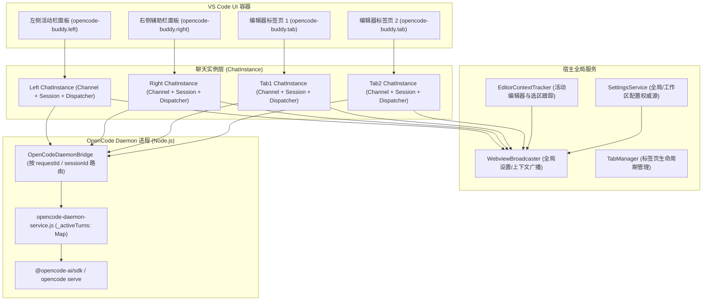

# 多标签页与多会话隔离架构设计文档

本文档详细记录 `opencode-vscode-plugin`（OpenCode Buddy）的**多实例会话隔离（One Instance Per Window / Tab）**、**精准中断隔离（Per-Session Abort Isolation）**、**全局设置广播机制（WebviewBroadcaster）** 与 **多视图编辑器上下文跟踪（EditorContextTracker）** 的设计与实现。

---

## 一、架构设计目标

1. **会话完全独立（One Instance Per View）**：
   - 左侧活动栏面板（`opencode-buddy.left`）、右侧辅助栏面板（`opencode-buddy.right`）以及编辑器区域打开的每一个标签页（`opencode-buddy.tab`）均分配独立的 `ChatInstance`。
   - 每一个实例拥有专属的 `OpenCodeSession`、`SessionState`、`MessageHandler` 状态机与 `MessageDispatcher`。
   - 用户在一个标签页发起提问时，只有该标签页进入流式接收状态，其他标签页/侧边栏互不影响。

2. **多端全局设置联动（Global Settings Broadcast）**：
   - 任何一个面板修改主题、语言、模型偏好、字号、快捷键或文件上下文开关时，通过 `WebviewBroadcaster` 实时同步推送到所有打开的视图。

3. **精准会话中断（Per-Session Abort Isolation）**：
   - 当用户在 Tab 1 点击“停止（Stop）”按钮时，仅中止 Tab 1 当前会话的流式生成，Tab 2 和 Tab 3 的流式生成不受任何影响继续正常执行。

4. **编辑器上下文多视图同步与焦点保持（Multi-View Editor Context Tracking）**：
   - VS Code 活动代码文件及选区变化时，自动将 `@/path/file#L1-L10` 广播给所有视图。
   - 当用户点击切换进入 WebviewPanel（此时 VS Code `activeTextEditor` 变为 `undefined`）时，系统自动保持最近一次有效的代码文件上下文，不误清空 ContextBar。

---

## 二、架构拓扑与交互关系

---

## 三、核心模块与实现机制

### 1. 聊天实例工厂 (`src/host/session/ChatInstance.ts`)
负责为每一个面板/标签页装配专属的通信链路与消息处理器：
- **`HandlerContext`**：封装当前视图的 `WebviewChannel`，并注入 `SettingsService`、`OpenCodeDaemonBridge` 与 `FileOps`。
- **`MessageDispatcher`**：注册完整的处理器集合（`SessionHandler`、`ModelProviderHandler`、`SettingsHandler`、`FontConfigHandler`、`CliModelsHandler`、`CliStatusHandler`、`ContextHandler`、`WindowEventHandler`、`SkillHandler`、`AgentHandler`、`HistoryHandler`、`ExportHandler`、`FileHandler`、`McpServerHandler`、`McpMarketplaceHandler`、`DiffHandler`、`UndoFileHandler`、`PermissionHandler`、`TokenTrackerHandler`）。
- **`OpenCodeSession`**：维护独立的会话状态（`SessionState`）、单轮流式上下文（`MarkerStreamContext`）与消息状态机（`MessageHandler`）。

### 2. 全局广播器 (`src/host/router/WebviewBroadcaster.ts`)
- 集中维护所有存活的 `WebviewChannel`（包含侧边栏的 `ProviderWebviewChannel` 与各标签页的 `SingleWebviewChannel`）。
- 提供 `broadcastJavaScript(functionName, ...args)` 与 `broadcastRaw(message)` 方法。
- 当接收到主题变化（`onIdeThemeChanged`）、字体配置（`onFontConfigChanged`）、守护进程状态（`onDaemonStatusChanged`）或编辑器选区（`addSelectionInfo` / `clearSelectionInfo`）时，自动广播给全量活跃视图。

### 3. 精准中断机制 (`Per-Session Abort`)

#### 痛点与根因
在早期实现中：
1. 宿主端 `OpenCodeDaemonBridge.sendAbort()` 盲目调用 `drainRequests()`，将宿主侧**所有正在等待响应的请求**（包括其他正在生成内容的标签页）一并清空并触发 `onAbort()` / `onComplete(false)`。
2. Daemon 端 `abortCurrentTurn()` 遍历了 `_activeTurns` 中的所有 session 并全部调用 `sdk.abort(sessionId)`。
3. 后台 SSE 事件流在分发 delta 标记时未将事件绑定到发起该轮 turn 的 `requestId` 上。

#### 修复与精准隔离方案
1. **宿主层精确定位**：
   - `PendingRequest` 结构记录关联的 `sessionId`。
   - `DaemonOutputCallback` 增加 `onStart(requestId)` 回调，`OpenCodeSession` 追踪当前 turn 的 `activeRequestId`。
   - `OpenCodeSession.interrupt()` 调用 `daemon.sendAbort(sessionId, requestId)`。
   - `OpenCodeDaemonBridge.sendAbort(sessionId?, requestId?)` 仅查找并移除目标请求，其他正在运行的会话请求保持活跃不受干扰。
2. **Daemon 层按会话中断**：
   - `daemon.js` 收到 `{ method: 'abort', params: { sessionId, requestId } }` 后，调用 `abortCurrentTurn(sessionId)`。
   - `abortCurrentTurn(targetSessionId)` 仅中止指定 `sessionId` 的 turn，并调用 `sdk.abort(sessionId)`。
3. **SSE 事件上下文绑定**：
   - 每个 turn 独立记录 `turn.requestId`。
   - `_handleEvent` 处理 SSE 事件时，通过 `requestContext.run({ id: turn.requestId }, () => ...)` 注入当前 turn 的 ALS 上下文，保证多会话并发流式输出标记精准打标并路由至正确的标签页。

### 4. 编辑器上下文跟踪 (`src/host/context/EditorContextTracker.ts`)
- 监听 `vscode.window.onDidChangeActiveTextEditor` 与 `vscode.window.onDidChangeTextEditorSelection`（200ms 防抖）。
- **焦点保持策略**：当用户切换进入 Webview 时，VS Code 的 `activeTextEditor` 为 `undefined`。此时优先从 `visibleTextEditors` 中寻找可见代码编辑器；若无可见编辑器但已有有效 `lastInfo` 时保持当前上下文，仅在用户主动关闭文件或关闭 `autoOpenFileEnabled` 设置时才触发 `clear()`。
- 通过 `WebviewBroadcaster.broadcastJavaScript('addSelectionInfo' | 'clearSelectionInfo')` 广播至所有视图。

### 5. 会话导出与工具栏二级菜单
- **`ExportHandler` 注册**：在 `createChatInstance` 中统一注册 `ExportHandler`，各 Tab 可独立将当前会话导出为 Markdown 文件、在编辑器中打开或复制至剪贴板。
- **工具栏二级菜单**：在 `ChatHeader.tsx` 右侧通过 `...` 更多操作下拉菜单容纳“导出会话为 Markdown”和“设置”，保持界面简洁美观。

---

## 四、验证与测试矩阵

| 场景 | 预期行为 | 验证状态 |
| :--- | :--- | :--- |
| **多 Tab 并发对话** | Tab 1、Tab 2、侧边栏同时提问，各视图独立流式输出，互不串流 | 通过 |
| **单 Tab 停止对话** | 在 Tab 1 点击停止，仅 Tab 1 终止并定住已生成气泡，Tab 2 继续生成 | 通过 |
| **全局主题与设置同步** | 在任意 Tab 修改设置，所有 Tab 与左/右侧边栏实时同步生效 | 通过 |
| **文件上下文跟踪** | 切换代码文件或选区，所有视图的 ContextBar 均实时更新 `@file#L...` 标签 | 通过 |
| **Tab 会话导出** | 在编辑器 Tab 的二级菜单中点击“导出会话为 Markdown”，正常导出当前会话内容 | 通过 |
