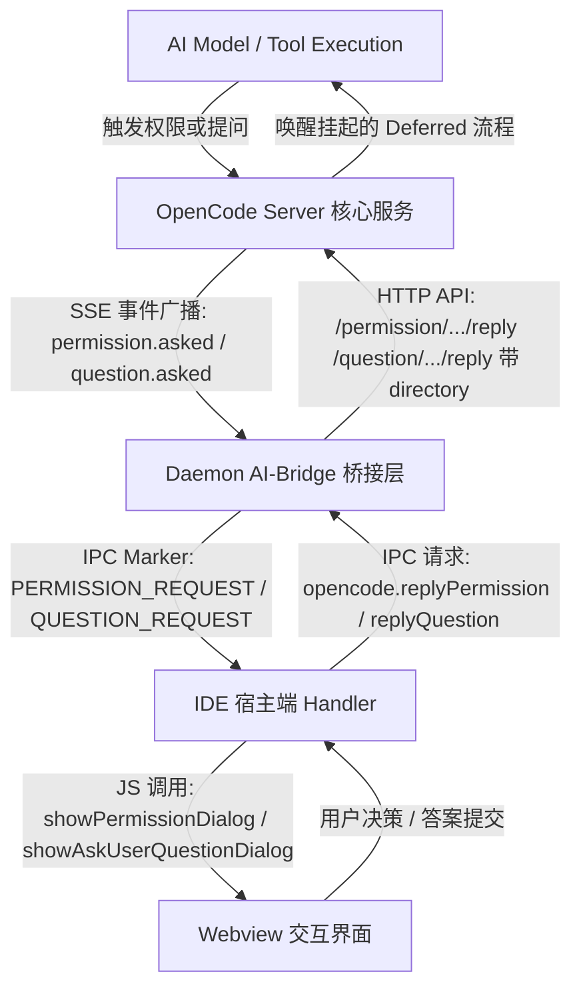
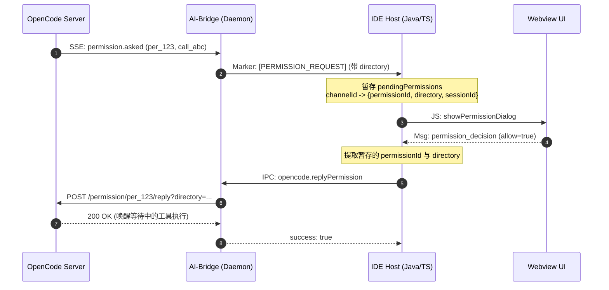
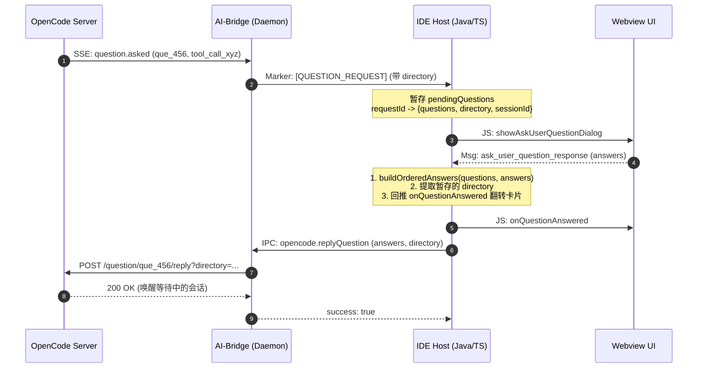
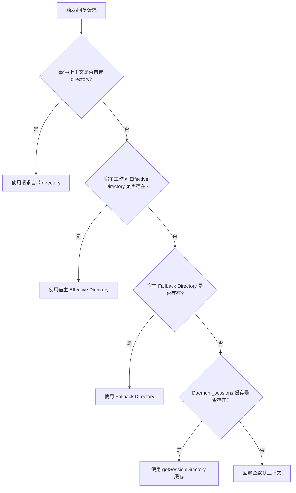

# OpenCode 权限审批与问题回答系统设计与全流程规范

本文档详细说明 OpenCode 插件体系（IntelliJ IDEA 插件与 VS Code 插件）中 **权限审批（Permission Approval）** 与 **提问回答（Ask User Question）** 的完整设计架构、时序交互、数据协议、工作区目录作用域路由以及异常韧性机制。

---

## 1. 架构总览与核心设计原则

在 OpenCode 体系中，AI 在执行某些敏感工具（如终端命令、写文件）或需要用户进一步明确意图（如需求澄清、分支确认）时，会通过服务端挂起当前执行流，并向客户端推送拦截请求：

1. **权限审批 (`Permission`)**：用于敏感操作授权（如 `bash`、`edit`、`write`），支持「仅允许一次 (once)」、「始终允许 (always)」、「拒绝 (reject)」。
2. **问题回答 (`AskUserQuestion`)**：用于 AI 与用户的多轮问答澄清，支持单选、多选、自定义输入与跳过 (reject)。



### 核心设计原则
- **实例级目录隔离（Directory-Scoped Instances）**：OpenCode Server 按照工作区目录（`directory`）划分独立的 `InstanceState`。所有审批与提问 API 必须严格携带 `directory` 参数，确保请求精准路由至对应的项目实例。
- **全链路参数闭环（End-to-End Propagation）**：事件到达宿主时立即捕获 `directory`；前端提交回复时逆向透传 `directory`；Bridge 层做多级回退兜底。
- **对话流非破坏性保护（Non-destructive Fault Tolerance）**：回调异常（如请求已被取消或过期）时仅做 UI 级状态失效展示与 Toast 提醒，**严禁**盲目调用 `sendAbort()` 破坏整个对话。

---

## 2. 权限审批 (Permission) 详细设计

### 2.1 数据协议与流转

1. **服务端事件到达 (`permission.asked` / `permissionV2.asked`)**：
   - 携带字段：`id` (如 `per_08a323...`), `sessionID`, `action` / `permission`, `resources` / `patterns`, `tool.callID` 等。
2. **Bridge 归一化 (`event-normalize.js`)**：
   - 统一输出 Marker: `[PERMISSION_REQUEST]`
   - 结构体：
     ```json
     {
       "type": "permission",
       "sessionId": "ses_f62957...",
       "permissionId": "per_08a323...",
       "toolUseId": "call_0807db...",
       "tool_use_id": "call_0807db...",
       "toolName": "Bash",
       "description": "rm -rf ...",
       "inputs": { "command": "Bash", "patterns": ["rm -rf ..."] },
       "directory": "/path/to/project"
     }
     ```
3. **宿主端暂存与分发 (`PermissionHandler`)**：
   - 记录 `channelId` (即 `toolUseId` / `call_xxx`) 到 `pendingPermissions` 字典，同时保存 `sessionId`、`permissionId` 与 `directory`。
   - 触发系统提示音及通知提醒。
   - 调用 Webview 前端方法 `window.showPermissionDialog(...)`。
4. **前端用户操作与决策回传**：
   - 用户选择「允许一次」、「始终允许」或「拒绝」。
   - 前端发送 `permission_decision` 消息至宿主：
     ```json
     {
       "channelId": "call_0807db...",
       "allow": true,
       "remember": false,
       "rejectMessage": ""
     }
     ```
5. **向 Daemon 发送决策 (`opencode.replyPermission`)**：
   - 宿主从暂存字典中取出关联的 `permissionId` 与 `directory`，发起 IPC 请求：
     ```json
     {
       "sessionId": "ses_f62957...",
       "permissionID": "per_08a323...",
       "reply": "allow",
       "rejectMessage": "",
       "directory": "/path/to/project"
     }
     ```
6. **调用 OpenCode Server API**：
   - Bridge 将 `reply` 映射为 OpenCode SDK 词汇（`allow` -> `once`, `allowAlways` -> `always`, `deny` -> `reject`）。
   - 调用 HTTP API: `POST /permission/{requestID}/reply?directory={directory}`。

### 2.2 权限审批时序图



---

## 3. 问题回答 (Ask User Question) 详细设计

### 3.1 数据协议与流转

1. **服务端事件到达 (`question.asked` / `questionV2.asked`)**：
   - 携带字段：`id` (如 `que_09d8ca...`), `sessionID`, `questions: [...]`, `tool` 等。
2. **Bridge 归一化 (`event-normalize.js`)**：
   - 统一输出 Marker: `[QUESTION_REQUEST]`
   - 结构体：
     ```json
     {
       "type": "question",
       "sessionId": "ses_f62957...",
       "requestId": "que_09d8ca...",
       "tool": "call_95dfae...",
       "questions": [
         {
           "question": "你想具体修改哪些部分？",
           "header": "修改范围",
           "multiSelect": false,
           "custom": true,
           "options": [
             { "label": "选项A", "description": "说明A" },
             { "label": "选项B", "description": "说明B" }
           ]
         }
       ],
       "directory": "/path/to/project"
     }
     ```
3. **宿主端暂存与分发 (`PermissionHandler`)**：
   - 记录 `requestId` (即 `que_xxx`) 到 `pendingQuestions` 字典，保存 `questions` 列表、`toolName` 及 `directory`。
   - 触发提问提示音与系统通知。
   - 调用 Webview 前端方法 `window.showAskUserQuestionDialog(...)`。
4. **前端用户交互与答案提交**：
   - 用户在表单中勾选选项或输入自定义文本。
   - 前端发送 `ask_user_question_response` 消息：
     ```json
     {
       "requestId": "que_09d8ca...",
       "answers": {
         "你想具体修改哪些部分？": "选项A"
       }
     }
     ```
5. **答案顺序重组与向 Daemon 提交 (`opencode.replyQuestion`)**：
   - 宿主端通过 `buildOrderedAnswers` 函数将键值对象转换为 OpenCode Server 所需的二维数组 `string[][]`（与原始 `questions` 定义顺序严格对应）。
   - 立即向 Webview 回推 `onQuestionAnswered`，以便前端将提问卡片就地翻转为「已回答」摘要卡片。
   - 携带 `directory` 发起 IPC 请求：
     ```json
     {
       "sessionId": "ses_f62957...",
       "questionID": "que_09d8ca...",
       "answers": [["选项A"]],
       "directory": "/path/to/project"
     }
     ```
6. **调用 OpenCode Server API**：
   - 调用 HTTP API: `POST /question/{requestID}/reply?directory={directory}`，Body: `{ "answers": [["选项A"]] }`。
   - 服务端收到答案后解除挂起，AI 继续下一步推理与工具调用。

### 3.2 跳过问题流程 (`rejectQuestion`)
若用户选择「跳过」问题：
- 前端发送 `ask_user_question_reject`。
- 宿主端向 Daemon 发送 `opencode.rejectQuestion`（携带 `directory`）。
- Daemon 调用 `POST /question/{requestID}/reject?directory={directory}`。
- 服务端向 AI 抛出 `QuestionRejectedError`，AI 获知用户跳过了该提问并继续后续流程。

### 3.3 提问回答时序图



---

## 4. 多工作区隔离与 Directory 路由解析规范

为防止在多窗口、多工作区或 Daemon 重启场景下发生 `Question/Permission request not found (404)`，客户端实行四级目录解析机制：



### 两端具体实现对齐

| 层级 | IntelliJ IDEA 插件 (`opencode-idea-gui`) | VS Code 插件 (`opencode-vscode-plugin`) |
| :--- | :--- | :--- |
| **请求暂存** | `PendingQuestion(..., pending.directory)`<br/>`OpencodePermissionRegistry.register(..., cwd)` | `pendingPermissions.set(..., { directory })`<br/>`pendingQuestions.set(..., { directory })` |
| **宿主目录获取** | `context.resolveEffectiveWorkingDirectory()` | `context.resolveEffectiveWorkingDirectory()`<br/>`context.getFallbackWorkingDirectory()` |
| **IPC 调用** | `bridge.replyQuestion(..., directory)`<br/>`bridge.replyPermission(..., directory)` | `daemon.request('opencode.replyQuestion', { ..., directory })`<br/>`daemon.request('opencode.replyPermission', { ..., directory })` |
| **Bridge 接收** | `getSessionDirectory(sessionId) \|\| explicitDirectory` | `getSessionDirectory(sessionId) \|\| explicitDirectory` |

---

## 5. 生命周期管理与异常韧性设计 (Resilience)

### 5.1 服务端主动关闭事件 (`onPromptClosed`)
当会话由于超时、外部中止或用户在其他入口（如终端 TUI）已完成答复时，服务端会广播 `*.replied` 或 `*.rejected` 事件：
- Bridge 捕获后发出 `[PERMISSION_CLOSED]` / `[QUESTION_CLOSED]`。
- 宿主端 `onPromptClosed` 收到通知后，**主动清理暂存字典**并调用前端 `forceClosePermissionDialog` / `forceCloseAskUserQuestionDialog`，避免「幽灵卡片」残留导致用户二次点击报错。

### 5.2 失败处理与防强杀策略
此前 VS Code 插件在 `handleReplyFailure` 中无差别执行 `daemon?.sendAbort()`，导致偶发性或良性错误直接摧毁整个生成中的对话。
**标准规范**：
1. **Toast 错误反馈**：通过 `showToast` 向用户展示具体错误信息。
2. **卡片状态翻转**：调用 `invalidateQuestionCard` / `invalidatePermissionCard` 将对应卡片置为失效状态。
3. **保护会话连续性**：**严禁调用 `sendAbort()`**，保持会话主循环正常运行，允许用户在界面上重试或通过其他方式继续交互。
