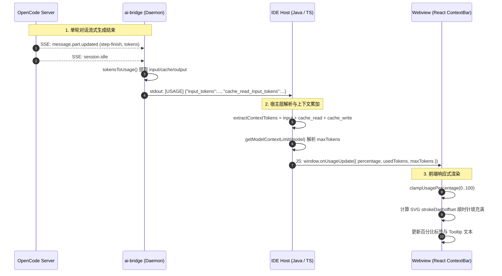

# Token 消耗统计与圆环指示器设计与实现规范

本文档阐述 OpenCode VS Code 插件与 IDEA 插件中 **Token 消耗统计与圆环进度指示器（`TokenIndicator`）** 的端到端架构设计、数据流向、Prompt Cache 计算模型、历史恢复机制及排查规范。

---

## 一、概述与核心目标

输入框工具栏左侧的 **Token 消耗圆环（TokenIndicator）** 用于直观展示当前对话会话占用的模型上下文窗口（Context Window）比例：
1. **实时容量感知**：随多轮对话进行，圆环顺时针填充，展示精确百分比（如 `24%`）。
2. **详细上下文 Tooltip**：鼠标悬停在圆环上时，展示格式化的精细数值与模型上限（如 `23.7% · 47.4k / 200k 上下文`）。
3. **上下文压缩引导**：点击圆环可直接触发会话上下文压缩（`/compact`），降低大模型 Token 消耗并维持会话注意力。

```
+-------------------------------------------------------------------------------+
|  [📎 附件]  [(○ 24%)]  |  @src/main.ts#L1-20 [×]                 [▾ 展开面板]  |
|             └── 悬停提示: "23.7% · 47.4k / 200k 上下文"                         |
+-------------------------------------------------------------------------------+
```

---

## 二、端到端架构与数据流



---

## 三、OpenCode Token 模型与 Prompt Cache 计算规范

### 1. 字段含义与差异
在启用 Prompt Cache 的大模型服务（如 Anthropic Claude、DeepSeek、OpenAI 等）中，每轮对话发送给模型的总 Tokens 分布如下：

| 字段名 | 含义 | 在上下文占用（Context Window）中的角色 |
| :--- | :--- | :--- |
| `input_tokens` / `input` | 本轮**新增/未命中缓存**的输入 Token（通常 100~800） | ✅ 计入上下文占用 |
| `cache_read_input_tokens` / `cache.read` | **命中缓存**的历史上下文 Token（多轮累积可达几万至几十万） | ✅ **必须计入上下文占用**（核心） |
| `cache_creation_input_tokens` / `cache.write` | **新写入缓存**的上下文 Token | ✅ 计入上下文占用 |
| `output_tokens` / `output` | 模型本轮生成的回答 Token | ❌ 不计入上下文占用（属于生成增量） |
| `reasoning_tokens` / `reasoning` | 思考/推理过程产生的 Token | ❌ 不计入上下文占用 |

### 2. 上下文占用量（Context Tokens）计算公式

$$\text{Context Tokens} = \text{input} + \text{cache.read} + \text{cache.write}$$

> **[!IMPORTANT] 为什么之前圆圈不增长？**
> 若计算时只读取 `input_tokens` 而忽略 `cache_read_input_tokens`，即使对话已进行 30 轮累积了 10 万 tokens，`input_tokens` 依然只有几百 tokens。计算出的比例为 $\frac{300}{200,000} = 0.15\%$，四舍五入后始终为 $0\%$，导致圆圈纹丝不动。

---

## 四、模型上下文容量（maxTokens）解析策略

模型上下文上限（分母）按照以下优先级解析（默认兜底 `200,000`）：

1. **显式容量后缀**：支持模型名称末尾显式标注的容量标记，如 `[1m]`（1,000,000）、`[128k]`（128,000）、`[200k]`（200,000）。
2. **精确匹配**：直接比对已知模型表（如 `gpt-5` $\to 400\text{k}$，`gpt-4o` $\to 128\text{k}$，`qwen3-coder` $\to 256\text{k}$）。
3. **剥离 Provider 前缀匹配**：将 `anthropic/claude-3-7-sonnet` 剥离为 `claude-3-7-sonnet` 后进行匹配。
4. **前缀模糊匹配**：如 `claude-3-7-sonnet-20250219` 自动命中 `claude-3-7-sonnet`。

---

## 五、历史会话加载与会话切换恢复

用户重新打开 IDE 或在历史记录中切换会话时，宿主端会执行历史恢复：

1. **历史消息反向扫描**：从历史记录最后一条开始反向检索，找到最新一条 Assistant 消息；
2. **多形态 Token 兼容提取**：按优先级检查 `turnUsage` $\to$ `tokens` $\to$ `usage` $\to$ `message.usage`；
3. **重新触发推送**：计算提取出的 `usedTokens` 与对应模型的 `maxTokens`，调用 `notifyUsageUpdate(usedTokens, maxTokens)` 发送给前端，确保切换会话后圆圈立即还原，不会闪烁或变为空白。

---

## 六、前端渲染与交互规范

* **SVG 环形渲染**：
  * 半径：$r = \frac{\text{size} - 3}{2} = 5.5\text{px}$（size 默认 14px）
  * 周长：$C = 2\pi r \approx 34.557\text{px}$
  * 偏移量：$\text{strokeOffset} = C \times (1 - \frac{\text{percentage}}{100})$
  * 起点从 12 点钟方向顺时针填充（SVG 容器设置 `transform: rotate(-90deg)`）。
* **格式化规则**：
  * 圆环右侧百分比标签：取整展示（如 `0%`、`24%`、`100%`）；
  * Hover Tooltip：保留一位小数（如 `23.7%`），容量以 `k` 为单位（如 `47.4k / 200k 上下文`）。
