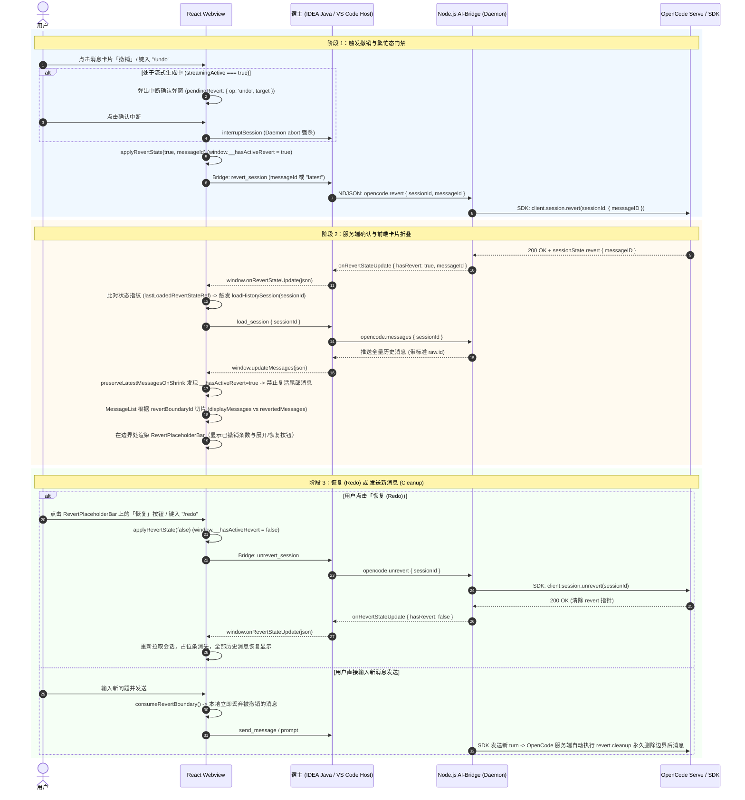
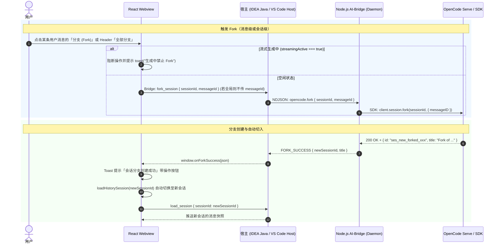

# OpenCode 会话撤销 (Undo)、恢复 (Redo) 与分支 (Fork) 架构与全流程设计文档

本文档系统阐述了在 **OpenCode IDEA GUI** 与 **OpenCode VS Code Plugin** 双端插件中，**会话撤销（Undo / Revert）**、**重做/恢复（Redo / Unrevert）** 与 **会话分支（Fork）** 的完整技术方案与架构逻辑，涵盖前端 React Webview、IntelliJ IDEA Java 宿主层、VS Code 扩展层、Node.js AI-Bridge Daemon 层以及 OpenCode Server / SDK 层的协同交互机制与异常自愈方案。

---

## 1. 架构总览与交互时序

整个 Undo、Redo 与 Fork 流程遵循 **服务端单一真实源 (Single Source of Truth)、前端乐观切片与只读隔离、繁忙态中断门禁保护、活跃撤销态防复活** 的设计原则。

### 1.1 Undo（撤销）与 Redo（恢复）时序图



---

### 1.2 Fork（分支会话）时序图



---

## 2. 核心模块与功能设计

### 2.1 会话撤销 (Undo / Revert)

#### 2.1.1 触发入口
1. **消息卡片快捷操作**（`MessageItem.tsx`）：
   - 仅在**最后一条人类用户消息**（`isLatestUserMessage === true`）的悬浮操作栏展示 Undo 图标按钮；
   - 点击即可撤销当前最后一次交互轮次。
2. **斜杠命令**：在输入框键入 `/undo`。
3. **繁忙态 FIFO 排队**：若处于非流式等待状态，排队入队依次执行。

#### 2.1.2 繁忙态确认机制（`pendingRevert`）
当大模型正在流式输出（`streamingActive === true`）时，OpenCode 服务端会拒绝 Revert 请求（返回 session busy 冲突）。
- 前端通过 `pendingRevert` 状态捕获操作目标；
- 弹出模态二次确认框：提示用户当前生成尚未完成，撤销将先强行中断生成；
- 用户点击确认后，首先调用 `interruptSession()` 触发 Daemon 层强杀中止请求，随后立即发起 `revert_session`。

#### 2.1.3 前端边界切片与启发式 Fallback（`MessageList.tsx`）
- 接收到 `revertBoundaryId` 时，通过 `useMemo` 计算：
  ```ts
  const { displayMessages, revertedMessages } = useMemo(() => {
    if (!revertBoundaryId) return { displayMessages: messages, revertedMessages: [] };
    let idx = messages.findIndex((m) => messageMatchesId(m, revertBoundaryId));
    // 启发式 Fallback：若 live 消息暂无服务端 msg_xxx ID 或传入 'latest'
    if (idx < 0) {
      for (let i = messages.length - 1; i >= 0; i--) {
        if (isHumanUserMessage(messages[i])) {
          idx = i;
          break;
        }
      }
    }
    if (idx < 0) return { displayMessages: messages, revertedMessages: [] };
    return {
      displayMessages: messages.slice(0, idx),
      revertedMessages: messages.slice(idx),
    };
  }, [messages, revertBoundaryId, messageMatchesId]);
  ```
- `displayMessages`（边界之前的消息）继续在主对话区域正常展示；
- `revertedMessages`（边界及之后被撤销的消息）传递给 `RevertPlaceholderBar` 占位条。

#### 2.1.4 防复活与收缩保护拦截（`messageSync.ts`）
- **核心痛点**：传统会话同步机制中存在 `preserveLatestMessagesOnShrink`（用于防御 Codex 压缩或网络波动导致消息意外缩短时丢失尾部）。但在用户主动撤销后，消息列表缩短属于预期行为。
- **解决方案**：引入 `window.__hasActiveRevert` 标记。当处于活跃撤销态时，`preserveLatestMessagesOnShrink` 立即返回 `nextList`，禁止将已撤销的消息尾部重新拼接回列表末尾，从根源杜绝被撤销消息在列表底部“幽灵复活”。

---

### 2.2 会话恢复 (Redo / Unrevert)

#### 2.2.1 触发入口
1. **占位条操作按钮**（`RevertPlaceholderBar.tsx`）：
   - 点击占位条右侧的 **“恢复 (Redo)”** 按钮；
2. **斜杠命令**：在输入框键入 `/redo`。

#### 2.2.2 恢复全链路
1. 前端调用 `applyRevertState(false)`，重置 `revertBoundaryId` 和 `window.__hasActiveRevert = false`；
2. 向宿主发送 Bridge 事件 `unrevert_session`；
3. Daemon 调用 SDK `client.session.unrevert(sessionId)`，服务端将 Session Revert 指针重置为 null；
4. 服务端推送 `onRevertStateUpdate({ hasRevert: false, messageId: null })`；
5. 前端拉取最新消息列表，全部消息完整还原，占位条自动销毁。

---

### 2.3 被撤销消息的原生卡片展示升级

为满足直观查看被撤销内容的需求，折叠展示已升级为 **原生卡片渲染**：

```
+-------------------------------------------------------------------------+
| [HistoryIcon] 已撤销 2 条消息                      [展开/折叠]  [恢复(Redo)] |
+-------------------------------------------------------------------------+
| (展开状态下：.reverted-messages-expanded-container)                      |
|                                                                         |
|  [User Bubble] (只读，禁用内部 Undo/Fork)                                 |
|  "请帮我编写一个快速排序算法"                                               |
|                                                                         |
|  [AI Assistant Bubble] (完整代码高亮 / Markdown / 思考链 / 工具调用折叠)   |
|  "```typescript ... ```"                                                |
+-------------------------------------------------------------------------+
```

- **组件级复用**：`RevertPlaceholderBar` 内部直接复用 `MessageItem` 组件；
- **只读保护与隔离**：
  - `forkDisabled = true`
  - `onUndo = undefined`
  - `onFork = undefined`
  - `streamingActive = false`
  - `isThinking = false`
- **视觉层区分**：外层容器添加 `.reverted-messages-expanded-container` 样式，具备 `opacity: 0.88` 微淡化及虚线分割框，清晰标示为历史已撤销轮次。

---

### 2.4 会话分支 (Fork)

#### 2.4.1 功能语义
Fork 允许用户以**历史中的任意一条消息为分叉点**，或者将**整个当前会话**复制为一个全新的独立会话，并在新会话中尝试不同的提问策略或模型，而不污染原会话的上下文记录。

#### 2.4.2 触发方式
1. **单条消息分叉**（`MessageItem.tsx`）：
   - 每条用户消息卡片悬浮操作栏中的 **“Fork (分支)”** 按钮；
   - 携带该消息的 `messageId` 发起分叉，分叉出的新会话只包含该消息及其之前的历史记录。
2. **全会话分叉**（`ChatHeader.tsx`）：
   - 顶部导航栏更多菜单中的 **“Fork Session”** 按钮；
   - 复制当前会话的全部历史至新会话。

#### 2.4.3 分叉生命周期
1. 前端发送 `fork_session` 事件至宿主；
2. Daemon 调用 SDK `client.session.fork(sessionId, { messageID })`；
3. OpenCode 服务端在数据库中深拷贝指定节点之前的全部 message/part，并生成全新的 `newSessionId`；
4. 宿主收到 `onForkSuccess` 回调后，向前端推送新会话信息；
5. 前端弹出成功 Toast（附带“立即前往”操作按钮），并自动调用 `loadHistorySession(newSessionId)` 切换至新分支。

---

## 3. 边界场景与异常自愈机制

| 异常场景 | 表现与潜在风险 | 系统的自愈与防护方案 |
| :--- | :--- | :--- |
| **未完成生成时点击 Undo** | 服务端因 Session Busy 直接报错拒绝 Revert | 前端检测 `streamingActive`，拦截直接请求并弹出 `pendingRevert` 确认框，确认后先执行 abort 强杀，再发起 Revert。 |
| **实时消息缺少服务端 ID** | 前端无法按 `msg_xxx` 查找到对应的切片边界 | `MessageList` 与 `consumeRevertBoundary` 自动触发 Fallback 启发式查找，从后向前自动定位最后一条人类用户消息。 |
| **撤销后发送新消息** | 若撤回删除信号未贯通到前端，被撤销的消息会被下一次全量快照推回（"复活"） | 双路径修复（详见 2.5 节）：① 服务端 `message.removed` 经 Daemon `[MESSAGE_REMOVED]` 贯通到前端，前端 `onMessagesRemoved` 按 id 剔除；② 宿主发送前 `trimMessagesFromRevertBoundary()` 按 revert 边界裁剪再推。 |
| **Revert 失败或网络断开** | 前端停留在错误的乐观切片状态 | 宿主监听 `onRevertError`，弹出错误 Toast，调用 `applyRevertState(false)` 并重新 `loadHistorySession` 强制拉取服务端真实数据。 |
| **双向循环重载 (Ping-Pong)** | `onRevertStateUpdate` 触发 `loadSession`，`loadSession` 又触发状态更新 | 前端引入 `lastLoadedRevertStateRef` 状态指纹，仅在 `sessionId + hasRevert + nextId` 发生实质变化时才触发 reload。 |

---

## 2.5 撤回消息的持久删除同步（防"复活"）

### 2.5.1 根因
撤回（revert）在服务端只写入一个「从此处往后作废」的指针，**不立即删除消息**；真正的删除发生在下一次发送时——服务端 `prompt()` 会先执行 `revert.cleanup(session)`（删除边界之后的所有消息），再落新用户消息。该 `cleanup` 会通过事件总线广播 `message.removed`。

但旧链路里这条「已删除」通知**没有贯通到前端**，导致三种账本不一致：
- **Daemon** 的事件分发（`_handleEvent`）未处理 `message.removed` / `message.part.removed`，事件被 `default: break` 丢弃；
- **宿主 `SessionState`** 没有「按 id 删除单条消息」的能力（只有 `addMessage` / `clearMessages`），删除即使转发也无处落地；
- **前端**只做了渲染层遮罩（`revertBoundaryId` 切片），数据层未变，且「本地删除」这类句式在通道里不存在——宿主听不到前端的删除。

结果：继续发消息时，宿主把「撤销前」的全量快照推给前端（推送时机甚至早于服务端 `cleanup`），前端以快照为准、遮罩被揭开，被撤销的消息当场「复活」。

### 2.5.2 修复路径（双端一致）
**路径 A — 服务端删除信号贯通到前端：**
1. Daemon `_handleEvent` 新增 `message.removed` 分支，emit `[MESSAGE_REMOVED]` marker（携带 `sessionID` + `messageID`）；
2. 宿主 Marker 解析 → MessageHandler 按 `raw.id` / `raw.uuid` 匹配，调用 `SessionState.removeMessagesByIds(ids)` 删除，并 `notifyMessageUpdate` 推给前端；
3. 前端 `window.onMessagesRemoved` 用 `matchesProviderMessageId` 从本地列表剔除——在随后 `updateMessages` 快照到达**之前**收缩，避开 `preserveLatestMessagesOnShrink` 把被删尾部抢救回来。

**路径 B — 发消息时按 revert 边界裁剪再推（避免「先闪现再消失」）：**
- 宿主发送服务（`OpenCodeSession`）推快照前先 `SessionState.trimMessagesFromRevertBoundary()`，按 `RevertState.messageID` 截掉边界之后。

> 附：`[REVERT_STATE]` 原实现因 `emitJsonStringMarker` 二次 JSON 编码导致宿主解析失败（boundary id 永远为空），已改为传对象并携带 `messageId`。

### 2.5.3 关键代码位置
- **Daemon**：`ai-bridge/services/opencode/opencode-daemon-service.js` → `_handleEvent` 的 `message.removed` 分支与 `[REVERT_STATE]` 对象化
- **宿主（VS Code TS）**：`MarkerParser`、`MessageHandler.handleMessageRemoved`、`SessionState.removeMessagesByIds` / `trimMessagesFromRevertBoundary`、`OpenCodeSession`
- **前端**：`App.tsx` 的 `window.onMessagesRemoved` + `utils/messageUtils.ts` 的 `matchesProviderMessageId` / `applyMessagesRemoved`

---

## 4. 相关源码与测试对照表

- **前端状态与切片**：
  - `webview/src/App.tsx`
  - `webview/src/components/MessageList.tsx`
  - `webview/src/components/MessageList/RevertPlaceholderBar.tsx`
  - `webview/src/hooks/windowCallbacks/messageSync.ts`
- **样式定义**：
  - `webview/src/styles/less/components/message.less`
- **自动化测试**：
  - `webview/src/components/MessageList/RevertPlaceholderBar.test.tsx`
  - `webview/src/components/MessageList.revert.test.tsx`
  - `webview/src/hooks/windowCallbacks/__tests__/messageSync.test.ts`
  - `webview/src/utils/messageUtils.test.ts`（`matchesProviderMessageId` / `applyMessagesRemoved` —— 撤回删除同步的视图层过滤）
