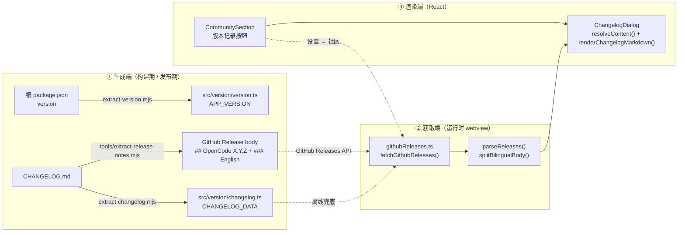
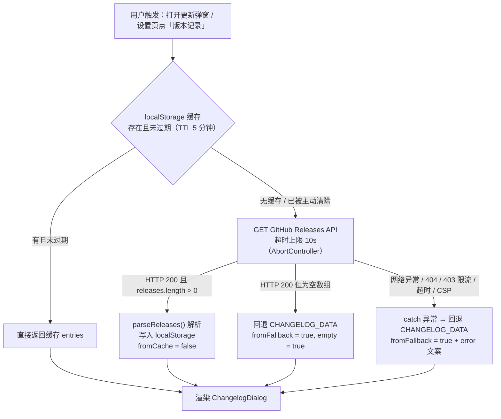

# 版本记录体系（Version & Changelog Strategy）

本文档说明 OpenCode Buddy VS Code 插件（`opencode-vscode-plugin`）的**版本号来源**、**变更记录生成**、**线上获取与回退**、**双语正文契约** 以及 **弹窗渲染** 的全链路实现。

---

## 1. 架构总览

版本记录由**三条互相独立、只靠文件格式耦合**的链路组成。理解本功能的关键是：生成端（Node 脚本）与消费端（React 弹窗）之间唯一的契约是 **GitHub Release body 的 Markdown 形状**，没有任何类型或 schema 约束它。



| 环节 | 输入 | 产出 | 载体 |
| :--- | :--- | :--- | :--- |
| 版本号 | 根 `package.json` | `APP_VERSION` | `webview/src/version/version.ts` |
| 离线变更记录 | `CHANGELOG.md` | `CHANGELOG_DATA` | `webview/src/version/changelog.ts` |
| 线上变更记录 | `CHANGELOG.md` 或 git log | Release body | GitHub Releases API |
| 运行时获取 | 缓存 / API / 兜底 | `ChangelogEntry[]` | `localStorage` + 内存 |
| 渲染 | `ChangelogEntry[]` | 分页弹窗 | `ChangelogDialog` |

---

## 2. 版本号来源

`webview/scripts/extract-version.mjs` 在构建期被 `prebuild` 钩子调用，从**根目录 `package.json`** 读取 `version`，生成：

```typescript
// webview/src/version/version.ts  —— 自动生成，勿手改
export const APP_VERSION = '0.0.1';
```

该文件由 `webview/src/main.tsx` 消费，用于首启弹窗与版本更新检测。

> ⚠️ **已知隐患**：根 `package.json` 的版本号（`0.0.1`）落后于 git tag 与 `CHANGELOG.md`（`v0.0.3`）。同时脚本把 `'0.0.1'` 硬编码为**读取失败时的 fallback**（`extract-version.mjs:15`），因此读取失败不会报错，而是**伪装成一个合法版本号**流向 UI。建议后续统一版本号源头。

---

## 3. 变更记录生成

### 3.1 离线打包：`CHANGELOG.md` → `CHANGELOG_DATA`

`webview/scripts/extract-changelog.mjs` 解析 `CHANGELOG.md`，产出 `webview/src/version/changelog.ts`：

```typescript
export interface ChangelogEntry {
  version: string;
  date: string;          // YYYY-MM-DD
  content: { en: string; zh: string };
}
```

解析规则：
- 以 `##### **...**` 五级标题切分版本段，从标题文本里用 `[（(]v?(\d+\.\d+…)）)]` 提取版本号；
- 日期支持 `2026年9月2日`（完整）与 `9月2日`（缺年份时补 `2025-`）；
- 按 `English：` / `中文：` 标记把段落拆成 `en` / `zh` 两个字段；**无标记时整体归入 `zh`，`en` 为空串**；
- 清洗阶段去掉 ``、`[x]` 复选框、`---` 分隔线。

生成时逐字节比对，内容未变则跳过写入（`Changelog file unchanged, skipping write`），避免无意义的 git diff。

### 3.2 线上发布：`CHANGELOG.md` → Release body

`tools/extract-release-notes.mjs` 在**发布期**为指定版本生成 GitHub Release body。它的职责是把 `CHANGELOG.md` 的 `中文：` / `English：` 标记**改写**成弹窗能识别的 `### English` 标题：

```
## OpenCode 0.0.3        ← 第 138 行统一前置的版本标题

- 中文条目 (abc1234)      ← 中文段

### English               ← 第 91 行插入的标记标题

- english item (abc1234)  ← 英文段
```

若 `CHANGELOG.md` 中找不到该版本段落，依次回退到 `git log <prevTag>..HEAD`、最后回退到 `Release <version>`，保证每个 release 总有正文。

---

## 4. 运行时获取与回退

`webview/src/version/githubReleases.ts` 实现三源混合策略：



### 4.1 仓库与接口常量

```typescript
export const GITHUB_REPO_OWNER = 'SenjuObito';
export const GITHUB_REPO_NAME = 'opencode-vscode-plugin';
export const GITHUB_REPO_URL = `https://github.com/${GITHUB_REPO_OWNER}/${GITHUB_REPO_NAME}.git`;
export const GITHUB_RELEASES_API = `https://api.github.com/repos/${GITHUB_REPO_OWNER}/${GITHUB_REPO_NAME}/releases`;
```

### 4.2 缓存

| Key | 内容 |
| :--- | :--- |
| `opencode.releases.cache` | 序列化的 `ChangelogEntry[]` |
| `opencode.releases.cacheTs` | 写入时间戳（毫秒） |

TTL 为 `RELEASES_CACHE_TTL_MS = 5 * 60 * 1000`。任何一步异常都返回 `null` 并静默降级为「无缓存」——缓存是纯加速层，损坏不得影响主流程。

**缓存的唯一失效入口**是 `clearReleasesCache()`。设置 → 社区点「版本记录」时会先调用它再请求（`CommunitySection/index.tsx:37`），所以**用户主动查看时总是拿线上最新数据**；5 分钟 TTL 实际只作用于首启/版本更新弹窗那条路径。

### 4.3 解析

`parseReleases()` 对每个 release：跳过非对象项、`tag_name` 为空则整条丢弃；版本号去掉前导 `v`；日期取 `published_at.slice(0, 10)`。

---

## 5. 双语正文契约与 `### English` 拆分

这是整条链路**最容易出错、也最容易静默出错**的一环。

### 5.1 契约

生成端（`tools/extract-release-notes.mjs:9-12` 的注释）定义：

> Bilingual sections are emitted as: Chinese content, then an `### English` heading, then the English
> content. The in-extension changelog dialog splits the release body on that `### English` heading
> to render one Chinese and one English block.

即**契约要求消费端按 `### English` 把 body 劈成两半**，分别填入 `content.zh` 与 `content.en`。

### 5.2 曾经的缺陷：整段内容渲染两遍

`parseReleases()` 早期实现把整段 body **同时赋给两个语言字段**：

```typescript
content: { en: body, zh: body },   // ❌ 旧行为
```

而 `ChangelogDialog.resolveContent()` 的设计是「中英两块都渲染」（见 §6），于是 `en === zh` → 返回 `[body, body]` → **中文段 + `### English` + 英文段被完整渲染两遍**，就是用户看到的「版本记录显示了两份」。

触发条件很隐蔽：它需要线上 release **真实拉取成功**。仓库名常量此前误指向 `opencode-idea-gui`，请求取不到数据、弹窗一直走本地 `CHANGELOG_DATA` 兜底（那里的 `en` / `zh` 是真实翻译、内容不同，只表现为中英双语）；仓库名修正为 `opencode-vscode-plugin` 后线上数据首次取到，这个潜伏缺陷才暴露出来。

### 5.3 修复

`splitBilingualBody()` 实现了契约：

```typescript
/** 发布流程给每个 body 前置 `## OpenCode <version>`（tools/extract-release-notes.mjs:138）。 */
const LEADING_VERSION_HEADING_RE = /^#{1,6}\s*OpenCode\b[^\n]*\n?/;

/** 双语 body 在英文译文前插入这个标记标题。 */
const ENGLISH_SECTION_RE = /^###\s+English\s*$/m;

function splitBilingualBody(body: string): { en: string; zh: string } {
  const marker = ENGLISH_SECTION_RE.exec(body);
  if (!marker) {
    // 手写 release notes 没有标记：整体归 zh，仍然只渲染一个块。
    return { en: '', zh: stripVersionHeading(body) };
  }
  return {
    zh: stripVersionHeading(body.slice(0, marker.index)),
    en: stripVersionHeading(body.slice(marker.index + marker[0].length)),
  };
}
```

两个设计要点：

1. **标题行剥离**（`stripVersionHeading`）。`renderChangelogMarkdown()` 不处理 `#` 标题（见 §6.2），
   `## OpenCode 0.0.2` 会作为字面量段落把 `## ` 原样吐到界面上。弹窗头部已有 `v` 徽章与日期，这行是冗余的，
   因此剥掉；剥离后线上路径与兜底路径（`CHANGELOG_DATA` 本就不含该行）形状一致。

2. **正则锚定 `OpenCode` 前缀**，而不是「首行是 `#` 就删」。手写的 `### Features` 这类子标题必须保留——
   现有测试用例的 fixture 就是 `'### Features\n- Fix subagents'`，笼统的正则会把它一并吃掉。

---

## 6. 渲染层

### 6.1 `resolveContent()` —— 为什么会有两块

`ChangelogDialog.tsx:32-44` 按当前界面语言决定中英顺序，**两块都渲染**（中间插 `<hr class="changelog-divider">`）：

```typescript
if (prefersChineseChangelog(language)) {
  if (zh) parts.push(zh);
  if (en) parts.push(en);
} else {
  if (en) parts.push(en);
  if (zh) parts.push(zh);
}
```

`prefersChineseChangelog()` 覆盖 `zh`、`zh-TW`、`zh-*`、`zh_*`。

这个设计本身是**正确**的——对兜底的 `CHANGELOG_DATA`（中英互为翻译、内容不同）正是期望的双语布局。
缺陷在数据侧：只要 `zh === en` 就会重复渲染。因此修复方式是**把数据拆对**，而不是在渲染层加 `en === zh` 去重
兜底——那只会掩盖问题。

### 6.2 `renderChangelogMarkdown()` —— 支持的 Markdown 子集

| 行类型 | 识别规则 | 输出 |
| :--- | :--- | :--- |
| 无序列表 | 以 `- ` 开头 | 连续项合并进 `<ul><li>` |
| Emoji 小标题 | 以 `✨🐛🔧🎉🚀💡⚡️🔥📦🛠️` 开头 | `<h4>` |
| 优先级行 | 以 `P0` / `P1` / `P2` 开头 | `<li>` |
| 普通段落 | 其余非空行 | `<p>` |
| 空行 | — | 关闭当前列表 |

行内格式支持 `` `code` ``、`***粗斜体***`、`**粗体**`、`*斜体*`（按最长优先匹配，避免 `***x***` 被 `**` 吞掉）。
所有文本先经 `escapeHtml()` 再注入。

**不支持 `#` / `##` / `###` 标题**——这是 §5.3 必须剥离 `## OpenCode X.Y.Z` 的直接原因。

### 6.3 分页与交互

- 页码状态 `currentPage`，弹窗打开时重置为 `initialPage`；
- 两处防御性收敛：effect 在 `entries` 缩短/为空时把页码拉回合法区间，渲染时再做一次 clamp——
  因为 effect 在 render 之后执行，当次渲染可能仍看到越界页码（列表被更短的 releases 异步替换时会发生）；
- 键盘导航：`Esc` 关闭、`←` / `→` 翻页；
- 页数 ≤ 10 显示圆点导航，否则显示 `当前/总数` 文本；
- 空态三选一：加载中、加载错误、无发布记录 / 该版本无正文。

---

## 7. 入口

| 入口 | 触发 | 数据加载 |
| :--- | :--- | :--- |
| 设置 → 社区 → 「版本记录」按钮 | `CommunitySection/index.tsx:34-53` | 先 `clearReleasesCache()` 强制拉线上，带 loading 态与失败 toast |
| 首启 / 版本更新弹窗 | `main.tsx` | 走 TTL 缓存优先的 `fetchGithubReleases()` |

`CommunitySection` 仅在**失败且回退后仍为空**时才弹错误 toast，避免离线兜底成功时误报。

---

## 8. 测试

`webview/src/version/githubReleases.test.ts`（vitest）通过 mock `globalThis.fetch` 覆盖：

- 仓库常量指向正确；
- 线上有 release 时解析并写缓存、二次调用命中缓存不再发请求；
- **双语 body 按 `### English` 正确拆分**（含标题行剥离，断言 `zh !== en`）；
- **无标记 body 不重复**（断言 `zh === '- 只有中文'`、`en === ''`）；
- HTTP 404 → 回退 `CHANGELOG_DATA` + `error === 'GitHub API 404'`；
- 网络异常 → 回退 `CHANGELOG_DATA` + 携带 error；
- 空数组 → 回退 `CHANGELOG_DATA` 并标记 `fromFallback`；
- `clearReleasesCache()` 后重新发起请求。

`webview/src/components/ChangelogDialog.test.tsx` 覆盖弹窗自身行为（不涉及块数量）。

---

## 9. 快速自查

线上 release body 形状是否符合契约：

```bash
curl -s https://api.github.com/repos/SenjuObito/opencode-vscode-plugin/releases \
  | python3 -c "import json,sys; [print(r['tag_name'], '| has marker:', '### English' in (r['body'] or '')) for r in json.load(sys.stdin)]"
```

每个 tag 应输出 `has marker: True`；若为 `False`，说明该 release 是手写的（无双语标记），
此时 `zh` 承接全文、`en` 为空，弹窗只渲染一个块——这是预期行为，不是缺陷。
